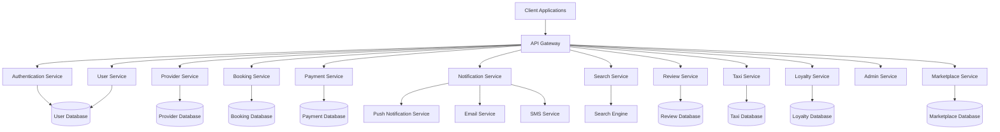
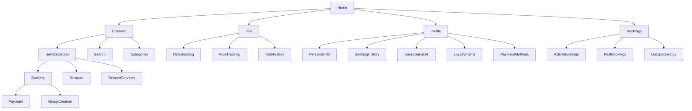

# Design Document: TourTrip.app

## Overview

TourTrip.app is a comprehensive super app designed to connect tourists, locals, and activity seekers with service providers in City X. The platform enables users to discover, book, and pay for various experiences including tours, events, activities, taxi services, restaurant reservations, and souvenir purchases. The system is designed to be scalable, secure, and provide an exceptional user experience across both mobile and web platforms.

This design document outlines the technical architecture, components, interfaces, data models, and implementation strategies for the TourTrip.app platform.

## Architecture

TourTrip.app will follow a microservices architecture to ensure scalability, maintainability, and the ability to deploy features independently. The system will be built using a cloud-native approach with containerization for consistent deployment across environments.

### High-Level Architecture



### Key Architectural Components

1. **Client Applications**
   - Mobile App (iOS and Android)
   - Web Application
   - Admin Dashboard

2. **API Gateway**
   - Request routing
   - Authentication and authorization
   - Rate limiting
   - Request/response transformation
   - API documentation

3. **Microservices**
   - Each service is responsible for a specific business domain
   - Services communicate via REST APIs and message queues
   - Each service has its own database
   - Services are containerized for consistent deployment

4. **Databases**
   - Relational databases for transactional data
   - NoSQL databases for flexible schema requirements
   - In-memory databases for caching and session management

5. **External Integrations**
   - Payment gateways
   - Mapping and navigation services
   - SMS and email providers
   - Push notification services

## Components and Interfaces

### 1. User Service

**Responsibilities:**
- User registration and authentication
- Profile management
- Preference settings
- User activity tracking

**Key Interfaces:**
- `/api/users` - User CRUD operations
- `/api/users/profile` - Profile management
- `/api/users/preferences` - User preferences
- `/api/users/activity` - User activity history

### 2. Provider Service

**Responsibilities:**
- Service provider registration and verification
- Provider profile management
- Service listing management
- Provider analytics

**Key Interfaces:**
- `/api/providers` - Provider CRUD operations
- `/api/providers/verification` - Provider verification process
- `/api/providers/listings` - Service listing management
- `/api/providers/analytics` - Provider performance metrics

### 3. Booking Service

**Responsibilities:**
- Service availability management
- Booking creation and management
- Group booking coordination
- Itinerary generation

**Key Interfaces:**
- `/api/bookings` - Booking CRUD operations
- `/api/bookings/availability` - Check service availability
- `/api/bookings/group` - Group booking management
- `/api/bookings/itinerary` - Itinerary generation and management

### 4. Payment Service

**Responsibilities:**
- Payment processing
- Commission calculation
- Refund processing
- Financial reporting

**Key Interfaces:**
- `/api/payments` - Payment processing
- `/api/payments/commission` - Commission management
- `/api/payments/refunds` - Refund processing
- `/api/payments/reports` - Financial reporting

### 5. Search Service

**Responsibilities:**
- Service discovery
- Search indexing
- Filtering and sorting
- Recommendation engine

**Key Interfaces:**
- `/api/search` - Search operations
- `/api/search/filters` - Search filtering
- `/api/search/recommendations` - Personalized recommendations

### 6. Review Service

**Responsibilities:**
- Rating and review management
- Review moderation
- Response management
- Aggregate rating calculation

**Key Interfaces:**
- `/api/reviews` - Review CRUD operations
- `/api/reviews/moderation` - Review moderation
- `/api/reviews/responses` - Provider responses
- `/api/reviews/ratings` - Aggregate ratings

### 7. Notification Service

**Responsibilities:**
- Push notifications
- Email notifications
- SMS notifications
- In-app messaging

**Key Interfaces:**
- `/api/notifications` - Notification management
- `/api/notifications/settings` - Notification preferences
- `/api/notifications/messages` - In-app messaging

### 8. Taxi Service

**Responsibilities:**
- Taxi booking and dispatch
- Driver management
- Ride tracking
- Fare calculation

**Key Interfaces:**
- `/api/taxi/rides` - Ride CRUD operations
- `/api/taxi/drivers` - Driver management
- `/api/taxi/tracking` - Ride tracking
- `/api/taxi/fares` - Fare calculation

### 9. Loyalty Service

**Responsibilities:**
- Points accrual and redemption
- Tier management
- Rewards catalog
- Referral program

**Key Interfaces:**
- `/api/loyalty/points` - Points management
- `/api/loyalty/tiers` - Tier management
- `/api/loyalty/rewards` - Rewards catalog
- `/api/loyalty/referrals` - Referral program

### 10. Admin Service

**Responsibilities:**
- Platform monitoring
- Content moderation
- User and provider management
- Support ticket management

**Key Interfaces:**
- `/api/admin/dashboard` - Admin dashboard
- `/api/admin/moderation` - Content moderation
- `/api/admin/support` - Support ticket management
- `/api/admin/reports` - System reporting

### 11. Marketplace Service

**Responsibilities:**
- Restaurant listing and reservation
- Souvenir shop management
- Product catalog
- Order processing

**Key Interfaces:**
- `/api/marketplace/restaurants` - Restaurant management
- `/api/marketplace/shops` - Souvenir shop management
- `/api/marketplace/products` - Product catalog
- `/api/marketplace/orders` - Order processing

## Data Models

### User Model

```json
{
  "id": "string",
  "email": "string",
  "phone": "string",
  "firstName": "string",
  "lastName": "string",
  "profilePicture": "string",
  "dateOfBirth": "date",
  "address": {
    "street": "string",
    "city": "string",
    "state": "string",
    "country": "string",
    "postalCode": "string"
  },
  "preferences": {
    "language": "string",
    "currency": "string",
    "notifications": {
      "email": "boolean",
      "push": "boolean",
      "sms": "boolean"
    }
  },
  "loyaltyInfo": {
    "points": "number",
    "tier": "string",
    "joinDate": "date"
  },
  "paymentMethods": [
    {
      "id": "string",
      "type": "string",
      "lastFour": "string",
      "expiryDate": "string",
      "isDefault": "boolean"
    }
  ],
  "createdAt": "datetime",
  "updatedAt": "datetime"
}
```

### Service Provider Model

```json
{
  "id": "string",
  "name": "string",
  "description": "string",
  "contactEmail": "string",
  "contactPhone": "string",
  "logo": "string",
  "coverImage": "string",
  "businessAddress": {
    "street": "string",
    "city": "string",
    "state": "string",
    "country": "string",
    "postalCode": "string",
    "coordinates": {
      "latitude": "number",
      "longitude": "number"
    }
  },
  "businessHours": [
    {
      "day": "string",
      "openTime": "string",
      "closeTime": "string",
      "isClosed": "boolean"
    }
  ],
  "categories": ["string"],
  "verificationStatus": "string",
  "verificationDocuments": [
    {
      "type": "string",
      "url": "string",
      "verifiedAt": "datetime"
    }
  ],
  "bankInfo": {
    "accountName": "string",
    "accountNumber": "string",
    "bankName": "string",
    "swiftCode": "string"
  },
  "commissionRate": "number",
  "rating": "number",
  "reviewCount": "number",
  "createdAt": "datetime",
  "updatedAt": "datetime"
}
```

### Service Listing Model

```json
{
  "id": "string",
  "providerId": "string",
  "title": "string",
  "description": "string",
  "category": "string",
  "subCategory": "string",
  "images": ["string"],
  "price": {
    "amount": "number",
    "currency": "string",
    "priceType": "string" // per person, fixed, etc.
  },
  "duration": {
    "value": "number",
    "unit": "string" // hours, days, etc.
  },
  "capacity": {
    "min": "number",
    "max": "number"
  },
  "location": {
    "address": {
      "street": "string",
      "city": "string",
      "state": "string",
      "country": "string",
      "postalCode": "string"
    },
    "coordinates": {
      "latitude": "number",
      "longitude": "number"
    },
    "meetingPoint": "string"
  },
  "inclusions": ["string"],
  "exclusions": ["string"],
  "itinerary": [
    {
      "title": "string",
      "description": "string",
      "duration": "string"
    }
  ],
  "availability": [
    {
      "date": "date",
      "startTime": "string",
      "endTime": "string",
      "availableSpots": "number"
    }
  ],
  "tags": ["string"],
  "policies": {
    "cancellation": "string",
    "refund": "string",
    "minimumAge": "number"
  },
  "status": "string", // active, inactive, pending
  "createdAt": "datetime",
  "updatedAt": "datetime"
}
```

### Booking Model

```json
{
  "id": "string",
  "userId": "string",
  "serviceId": "string",
  "providerId": "string",
  "bookingDate": "date",
  "startTime": "string",
  "endTime": "string",
  "participants": {
    "adults": "number",
    "children": "number",
    "infants": "number"
  },
  "contactInfo": {
    "name": "string",
    "email": "string",
    "phone": "string"
  },
  "specialRequests": "string",
  "price": {
    "basePrice": "number",
    "taxes": "number",
    "fees": "number",
    "discounts": "number",
    "totalPrice": "number",
    "currency": "string"
  },
  "paymentStatus": "string",
  "paymentId": "string",
  "bookingStatus": "string", // confirmed, pending, cancelled, completed
  "cancellationInfo": {
    "cancelledAt": "datetime",
    "reason": "string",
    "refundAmount": "number"
  },
  "isGroupBooking": "boolean",
  "groupBookingId": "string",
  "transportationInfo": {
    "pickupLocation": {
      "address": "string",
      "coordinates": {
        "latitude": "number",
        "longitude": "number"
      }
    },
    "dropoffLocation": {
      "address": "string",
      "coordinates": {
        "latitude": "number",
        "longitude": "number"
      }
    },
    "taxiBookingId": "string"
  },
  "createdAt": "datetime",
  "updatedAt": "datetime"
}
```

### Taxi Ride Model

```json
{
  "id": "string",
  "userId": "string",
  "driverId": "string",
  "status": "string", // requested, accepted, in_progress, completed, cancelled
  "pickupLocation": {
    "address": "string",
    "coordinates": {
      "latitude": "number",
      "longitude": "number"
    }
  },
  "dropoffLocation": {
    "address": "string",
    "coordinates": {
      "latitude": "number",
      "longitude": "number"
    }
  },
  "requestTime": "datetime",
  "pickupTime": "datetime",
  "dropoffTime": "datetime",
  "estimatedDuration": "number", // in minutes
  "estimatedDistance": "number", // in kilometers
  "fare": {
    "baseFare": "number",
    "distanceFare": "number",
    "timeFare": "number",
    "priorityFee": "number",
    "totalFare": "number",
    "currency": "string"
  },
  "paymentStatus": "string",
  "paymentId": "string",
  "commissionRate": "number",
  "commissionAmount": "number",
  "isPriority": "boolean",
  "isReservation": "boolean",
  "reservationTime": "datetime",
  "relatedBookingId": "string",
  "rating": {
    "userRating": "number",
    "driverRating": "number",
    "userReview": "string",
    "driverReview": "string"
  },
  "createdAt": "datetime",
  "updatedAt": "datetime"
}
```

### Group Booking Model

```json
{
  "id": "string",
  "organizerId": "string",
  "serviceId": "string",
  "name": "string",
  "description": "string",
  "bookingDate": "date",
  "startTime": "string",
  "endTime": "string",
  "participants": [
    {
      "userId": "string",
      "name": "string",
      "email": "string",
      "status": "string", // invited, accepted, declined, paid
      "paymentStatus": "string",
      "paymentId": "string",
      "amount": "number"
    }
  ],
  "totalPrice": {
    "amount": "number",
    "currency": "string"
  },
  "status": "string", // draft, confirmed, cancelled, completed
  "individualBookingIds": ["string"],
  "createdAt": "datetime",
  "updatedAt": "datetime"
}
```

### Loyalty Points Transaction Model

```json
{
  "id": "string",
  "userId": "string",
  "type": "string", // earn, redeem, expire, adjust
  "points": "number",
  "description": "string",
  "referenceId": "string", // booking ID, referral ID, etc.
  "balanceBefore": "number",
  "balanceAfter": "number",
  "expiryDate": "date",
  "createdAt": "datetime"
}
```

## Error Handling

The system will implement a comprehensive error handling strategy to ensure robustness and provide meaningful feedback to users.

### Error Categories

1. **Validation Errors**
   - Invalid input data
   - Missing required fields
   - Format violations

2. **Authentication Errors**
   - Invalid credentials
   - Expired tokens
   - Insufficient permissions

3. **Business Logic Errors**
   - Booking conflicts
   - Insufficient availability
   - Business rule violations

4. **System Errors**
   - Database connection issues
   - External service failures
   - Internal processing errors

### Error Response Format

```json
{
  "status": "error",
  "code": "string", // error code
  "message": "string", // user-friendly message
  "details": [
    {
      "field": "string", // for validation errors
      "message": "string"
    }
  ],
  "requestId": "string", // for tracking
  "timestamp": "datetime"
}
```

### Error Handling Strategy

1. **Client-Side Validation**
   - Immediate feedback to users
   - Prevent unnecessary API calls

2. **API Gateway Validation**
   - Request schema validation
   - Authentication and authorization

3. **Service-Level Validation**
   - Business rule validation
   - Data integrity checks

4. **Global Error Handlers**
   - Consistent error formatting
   - Logging and monitoring
   - Graceful degradation

5. **Retry Mechanisms**
   - Automatic retries for transient failures
   - Circuit breakers for persistent issues

## Testing Strategy

The testing strategy for TourTrip.app will be comprehensive, covering all aspects of the system to ensure reliability, performance, and security.

### Testing Levels

1. **Unit Testing**
   - Test individual components in isolation
   - Mock external dependencies
   - Achieve high code coverage

2. **Integration Testing**
   - Test interactions between components
   - Verify API contracts
   - Test database operations

3. **End-to-End Testing**
   - Test complete user flows
   - Simulate real user interactions
   - Cover critical business processes

4. **Performance Testing**
   - Load testing for peak usage scenarios
   - Stress testing for system limits
   - Endurance testing for stability

5. **Security Testing**
   - Vulnerability scanning
   - Penetration testing
   - Authentication and authorization testing

### Testing Tools and Frameworks

1. **Unit Testing**
   - Jest for JavaScript/TypeScript
   - JUnit for Java
   - XCTest for iOS
   - JUnit/Espresso for Android

2. **API Testing**
   - Postman
   - REST Assured
   - Swagger Test Templates

3. **End-to-End Testing**
   - Cypress
   - Selenium
   - Appium for mobile

4. **Performance Testing**
   - JMeter
   - Gatling
   - Locust

5. **Security Testing**
   - OWASP ZAP
   - SonarQube
   - Dependency scanning tools

### Testing Environments

1. **Development Environment**
   - For developer testing
   - Refreshed frequently
   - Mocked external services

2. **Testing Environment**
   - For QA testing
   - Stable data
   - Integrated with test versions of external services

3. **Staging Environment**
   - Production-like
   - For final verification
   - Performance and security testing

4. **Production Environment**
   - Monitoring and observability
   - Canary deployments
   - A/B testing

## Mobile App Design (Kotlin Multiplatform)

TourTrip.app will be developed using Kotlin Multiplatform Mobile (KMM) to share code between Android and iOS platforms. This approach allows for maintaining a single codebase for business logic while using native UI components for each platform.

### Architecture

The mobile app will follow a clean architecture approach with the following layers:

1. **Shared Code (KMM)**
   - Data models
   - Repository implementations
   - Business logic
   - Network communication
   - Data storage

2. **Platform-Specific Code**
   - UI implementation
   - Platform-specific features
   - Native integrations

### Technology Stack

1. **Shared Code**
   - Kotlin Multiplatform Mobile
   - Ktor for networking
   - SQLDelight for database
   - Kotlinx.serialization for JSON parsing
   - Kotlinx.coroutines for asynchronous operations

2. **Android**
   - Jetpack Compose for UI
   - Android Architecture Components
   - Material Design 3
   - Coil for image loading

3. **iOS**
   - SwiftUI for UI
   - Combine for reactive programming
   - Kingfisher for image loading

### Key Screens

1. **Onboarding & Authentication**
   - Welcome screen
   - Registration
   - Login
   - Password recovery

2. **Home & Discovery**
   - Featured services
   - Categories
   - Search
   - Personalized recommendations

3. **Service Details**
   - Images and descriptions
   - Availability calendar
   - Reviews and ratings
   - Booking options

4. **Booking Flow**
   - Date and time selection
   - Participant information
   - Special requests
   - Payment

5. **User Profile**
   - Personal information
   - Booking history
   - Saved services
   - Loyalty points

6. **Taxi Booking**
   - Pickup and dropoff selection
   - Fare estimate
   - Driver tracking
   - Rating and review

7. **Group Booking**
   - Create group
   - Invite participants
   - Track responses
   - Payment management

8. **Marketplace**
   - Restaurant listings
   - Souvenir shop catalog
   - Cart and checkout
   - Order tracking

### Navigation Structure



### Shared Code Structure

```
shared/
├── commonMain/
│   ├── kotlin/
│   │   ├── com.tourtrip.app/
│   │   │   ├── data/
│   │   │   │   ├── api/
│   │   │   │   ├── db/
│   │   │   │   └── repository/
│   │   │   ├── domain/
│   │   │   │   ├── model/
│   │   │   │   ├── usecase/
│   │   │   │   └── repository/
│   │   │   └── utils/
│   ├── resources/
├── androidMain/
│   ├── kotlin/
│   │   └── com.tourtrip.app/
│   │       ├── platform/
│   │       └── ui/
│   └── resources/
└── iosMain/
    └── kotlin/
        └── com.tourtrip.app/
            └── platform/
```

## Web Platform Design

The web platform will provide all the functionality of the mobile app except for the taxi service. It will be designed with responsive principles to work across desktop, tablet, and mobile browsers.

### Key Pages

1. **Home Page**
   - Hero section with search
   - Featured experiences
   - Categories
   - Testimonials

2. **Search Results**
   - Filtering options
   - Map view
   - List view
   - Sorting options

3. **Service Details**
   - Image gallery
   - Detailed information
   - Availability calendar
   - Reviews and booking form

4. **User Dashboard**
   - Booking management
   - Profile settings
   - Loyalty program
   - Payment methods

5. **Checkout Process**
   - Cart review
   - User information
   - Payment
   - Confirmation

### Technology Stack

1. **Frontend**
   - React.js for component-based UI
   - Next.js for server-side rendering and SEO
   - Tailwind CSS for styling
   - Redux for state management

2. **Backend**
   - Node.js with Express
   - GraphQL API for efficient data fetching
   - JWT for authentication

3. **Infrastructure**
   - Containerized deployment
   - CDN for static assets
   - Serverless functions for specific features

## Admin Dashboard Design

The admin dashboard will provide comprehensive tools for platform management, monitoring, and support.

### Key Sections

1. **Overview Dashboard**
   - Key metrics and KPIs
   - Real-time activity
   - System health

2. **User Management**
   - User search and filtering
   - Profile viewing and editing
   - Account actions

3. **Provider Management**
   - Provider verification
   - Service listing approval
   - Performance monitoring

4. **Booking Management**
   - Booking search and filtering
   - Booking details
   - Issue resolution

5. **Content Moderation**
   - Review moderation
   - Listing content approval
   - Reported content handling

6. **Support Management**
   - Support ticket queue
   - Live chat management
   - Knowledge base management

7. **Financial Management**
   - Transaction monitoring
   - Commission tracking
   - Payout management

8. **System Configuration**
   - Feature toggles
   - Commission rates
   - Notification templates

## Security Considerations

1. **Authentication and Authorization**
   - Multi-factor authentication
   - Role-based access control
   - JWT with short expiration
   - Refresh token rotation

2. **Data Protection**
   - Encryption at rest and in transit
   - PII data handling compliance
   - Data minimization principles
   - Regular security audits

3. **API Security**
   - Rate limiting
   - Input validation
   - CORS policies
   - API keys and secrets management

4. **Payment Security**
   - PCI DSS compliance
   - Tokenization of payment details
   - Fraud detection systems
   - Transaction monitoring

5. **Infrastructure Security**
   - Network segmentation
   - Firewall rules
   - Regular vulnerability scanning
   - Security patching process

## Scalability and Performance

1. **Horizontal Scaling**
   - Stateless services
   - Load balancing
   - Auto-scaling based on demand

2. **Caching Strategy**
   - CDN for static assets
   - Redis for application caching
   - Query result caching

3. **Database Optimization**
   - Indexing strategy
   - Read replicas
   - Sharding for high-volume data
   - Connection pooling

4. **Asynchronous Processing**
   - Message queues for background jobs
   - Event-driven architecture
   - Scheduled tasks for maintenance

5. **Performance Monitoring**
   - Real-time metrics
   - Performance bottleneck identification
   - User experience monitoring

## Deployment and DevOps

1. **CI/CD Pipeline**
   - Automated testing
   - Continuous integration
   - Automated deployments
   - Rollback capabilities

2. **Environment Management**
   - Development, testing, staging, production
   - Environment parity
   - Configuration management

3. **Monitoring and Logging**
   - Centralized logging
   - Error tracking
   - Performance monitoring
   - Alerting system

4. **Disaster Recovery**
   - Regular backups
   - Failover mechanisms
   - Recovery testing
   - Business continuity planning

## Phased Implementation Approach

The implementation of TourTrip.app will follow a phased approach to allow for incremental development, testing, and deployment.

### Phase 1: Core Platform

- User management
- Service provider management
- Basic service listings
- Simple booking flow
- Payment processing

### Phase 2: Enhanced Features

- Reviews and ratings
- Search and discovery improvements
- Loyalty program
- Group bookings
- Notifications system

### Phase 3: Marketplace Expansion

- Restaurant listings and reservations
- Souvenir shops
- Enhanced user profiles
- Advanced booking options

### Phase 4: Taxi Integration

- Taxi booking interface
- Driver management
- Ride tracking
- Integration with existing bookings

### Phase 5: Advanced Features

- AI-powered recommendations
- Advanced analytics
- Enhanced admin tools
- Mobile app enhancements

## Conclusion

This design document provides a comprehensive blueprint for the development of TourTrip.app. The architecture and components described are designed to meet all the requirements while ensuring scalability, security, and an exceptional user experience. The phased implementation approach allows for incremental development and validation of the platform's features.