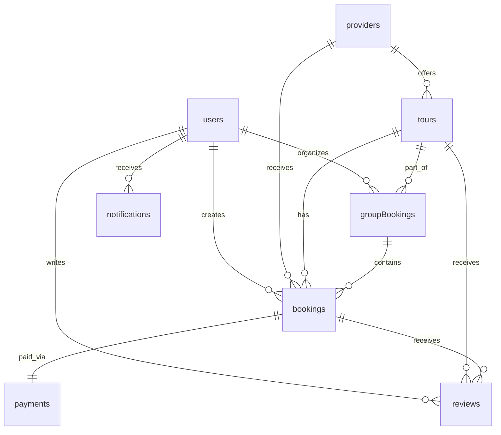

# TourTrip.app Veri Kontratları

## Genel Bakış

Bu dokümantasyon, TourTrip.app platformunda kullanılan tüm veri modellerini, şemalarını ve veri yapılarını kapsamlı şekilde tanımlar. Tüm veri modelleri **TypeScript** tip sistemi kullanılarak tanımlanmış ve **JSON Schema** standartlarına uyumludur.

## Veri Modelleme Prensipleri

### Tasarım Prensipleri
1. **Type Safety**: Tüm veriler güçlü tiplandırma ile korunur
2. **Validation**: Her veri modeli Zod şeması ile doğrulanır
3. **Consistency**: Tüm modeller tutarlı adlandırma ve yapı kullanır
4. **Extensibility**: Yeni özellikler için geriye uyumlu genişletme
5. **Documentation**: Her model detaylı dokümantasyon içerir

### Veri Tipleri

#### Temel Tipler
```typescript
// Timestamp tipleri
type Timestamp = string; // ISO 8601 format: "2023-12-15T10:30:00Z"
type UnixTimestamp = number; // Unix timestamp in seconds

// Para birimi tipleri
interface Money {
  amount: number; // Pozitif decimal sayı (ör: 299.99)
  currency: string; // ISO 4217 kodu (TRY, USD, EUR)
}

// Koordinat tipleri
interface Coordinates {
  latitude: number; // -90 ile 90 arası
  longitude: number; // -180 ile 180 arası
}

// Adres tipleri
interface Address {
  street: string;
  city: string;
  state?: string;
  country: string;
  postalCode: string;
}

// İletişim bilgileri
interface ContactInfo {
  email: string; // Geçerli email formatı
  phone?: string; // Uluslararası format: +905551234567
  emergencyContact?: {
    name: string;
    phone: string;
    relationship: string;
  };
}
```

## Ana Veri Modelleri

### 1. Kullanıcı (`User`)

Kullanıcı profil bilgileri ve sistemdeki tüm kullanıcı verilerini içerir.

```typescript
interface User {
  // Temel kimlik bilgileri
  id: string; // UUID formatında benzersiz kimlik
  email: string; // Benzersiz email adresi
  phone?: string; // İsteğe bağlı telefon numarası

  // Kişisel bilgiler
  firstName: string; // 1-50 karakter
  lastName: string; // 1-50 karakter
  profilePicture?: string; // Profil fotoğrafı URL'i
  dateOfBirth?: Timestamp; // Doğum tarihi (GDPR için gerekli)

  // Adres bilgileri
  address?: Address;

  // Kullanıcı tercihleri
  preferences: {
    language: 'tr' | 'en' | 'de' | 'ru' | 'ar'; // Desteklenen diller
    currency: string; // Tercih edilen para birimi (TRY, USD, EUR)
    timezone: string; // Kullanıcının zaman dilimi
    notifications: {
      email: boolean; // Email bildirimleri
      push: boolean; // Push bildirimler
      sms: boolean; // SMS bildirimler
    };
    marketing: {
      promotionalEmails: boolean;
      personalizedOffers: boolean;
    };
  };

  // Sadakat programı bilgileri
  loyaltyInfo?: {
    points: number; // Mevcut puan bakiyesi
    tier: 'bronze' | 'silver' | 'gold' | 'platinum'; // Üyelik seviyesi
    joinDate: Timestamp; // Programa katılma tarihi
    lifetimeValue: number; // Toplam harcama tutarı
  };

  // Ödeme yöntemleri
  paymentMethods: Array<{
    id: string;
    type: 'credit_card' | 'debit_card' | 'paypal' | 'bank_transfer';
    lastFour?: string; // Kartın son 4 hanesi
    expiryDate?: string; // Son kullanma tarihi
    isDefault: boolean; // Varsayılan ödeme yöntemi
    billingAddress?: Address;
  }>;

  // Sistem rolleri
  role: 'user' | 'tour_operator' | 'admin' | 'moderator';

  // Güvenlik ve doğrulama
  security: {
    emailVerified: boolean;
    phoneVerified: boolean;
    twoFactorEnabled: boolean;
    passwordLastChanged: Timestamp;
  };

  // Aktivite bilgileri
  activity: {
    lastLoginAt?: Timestamp;
    loginCount: number;
    totalBookings: number;
    totalSpent: Money;
  };

  // Metadata
  createdAt: Timestamp;
  updatedAt: Timestamp;
  deletedAt?: Timestamp; // Soft delete için
}
```

### 2. Tur Sağlayıcısı (`Provider`)

Tur şirketleri ve servis sağlayıcılarının bilgileri.

```typescript
interface Provider {
  // Temel bilgiler
  id: string;
  userId: string; // İlişkili kullanıcı ID'si

  // İş bilgileri
  name: string; // Şirket/işletme adı
  description: string; // İşletme açıklaması
  logo?: string; // Logo URL'i
  coverImage?: string; // Kapak fotoğrafı URL'i

  // İletişim bilgileri
  contactInfo: {
    email: string;
    phone: string;
    website?: string;
    socialMedia?: {
      instagram?: string;
      facebook?: string;
      twitter?: string;
    };
  };

  // Adres ve konum
  businessAddress: Address & {
    coordinates: Coordinates;
  };

  // Çalışma saatleri
  businessHours: Array<{
    day: 'monday' | 'tuesday' | 'wednesday' | 'thursday' | 'friday' | 'saturday' | 'sunday';
    openTime: string; // "09:00"
    closeTime: string; // "18:00"
    isClosed: boolean;
    breaks?: Array<{
      startTime: string;
      endTime: string;
    }>;
  }>;

  // Kategoriler ve uzmanlık alanları
  categories: Array<'culture' | 'adventure' | 'food' | 'nature' | 'shopping' | 'entertainment' | 'transport'>;
  specializations: string[]; // Özel uzmanlık alanları

  // Doğrulama ve lisans bilgileri
  verification: {
    status: 'pending' | 'approved' | 'rejected' | 'suspended';
    documents: Array<{
      type: 'business_license' | 'tax_id' | 'insurance' | 'tourism_license' | 'other';
      url: string; // Belge URL'i
      verifiedAt?: Timestamp;
      verifiedBy?: string; // Admin kullanıcı ID'si
      expiryDate?: Timestamp;
    }>;
    notes?: string; // Doğrulama notları
  };

  // Finansal bilgiler
  financial: {
    bankInfo?: {
      accountName: string;
      accountNumber: string; // Şifrelenmiş
      bankName: string;
      swiftCode: string;
    };
    commissionRate: number; // Platform komisyon oranı (0.15 = %15)
    payoutSchedule: 'weekly' | 'biweekly' | 'monthly';
    taxInfo?: {
      taxId: string;
      taxOffice: string;
    };
  };

  // Performans metrikleri
  metrics: {
    rating: number; // Ortalama puan (1-5)
    reviewCount: number;
    totalBookings: number;
    completedBookings: number;
    cancelledBookings: number;
    responseTime: number; // Saat cinsinden ortalama yanıt süresi
    profileCompletion: number; // Profil tamamlama yüzdesi
  };

  // Sistem durumu
  status: 'active' | 'inactive' | 'suspended' | 'pending';
  featured: boolean; // Öne çıkan sağlayıcı

  // Metadata
  createdAt: Timestamp;
  updatedAt: Timestamp;
}
```

### 3. Tur (`Tour`)

Tur ve aktivite detayları.

```typescript
interface Tour {
  // Temel bilgiler
  id: string;
  providerId: string;

  // İçerik
  title: string; // 1-200 karakter
  description: string; // 1-2000 karakter
  shortDescription?: string; // Kısa açıklama (SEO için)

  // Kategorilendirme
  category: 'culture' | 'adventure' | 'food' | 'nature' | 'shopping' | 'entertainment' | 'transport';
  subCategory?: string;
  tags: string[]; // Arama ve filtreleme için etiketler
  difficulty: 'easy' | 'moderate' | 'challenging' | 'extreme';

  // Fiyatlandırma
  price: {
    amount: number;
    currency: string;
    priceType: 'per_person' | 'fixed' | 'per_group' | 'tiered';
    tiers?: Array<{ // Katmanlı fiyatlandırma
      name: string;
      amount: number;
      description: string;
    }>;
  };

  // Zaman ve kapasite
  duration: {
    value: number;
    unit: 'minutes' | 'hours' | 'days';
  };
  capacity: {
    min: number; // Minimum kişi sayısı
    max: number; // Maksimum kişi sayısı
  };

  // Konum bilgileri
  location: {
    address: Address;
    coordinates: Coordinates;
    meetingPoint: string; // Buluşma noktası açıklaması
    landmarks?: string[]; // Yakınındaki önemli yerler
  };

  // Program detayları
  itinerary: Array<{
    day?: number;
    title: string;
    description: string;
    duration?: string;
    activities: string[];
    location?: {
      name: string;
      coordinates?: Coordinates;
    };
  }>;

  // Dahil olan ve olmayan hizmetler
  inclusions: string[]; // Dahil olan hizmetler
  exclusions: string[]; // Hariç tutulan hizmetler

  // Gereksinimler ve politikalar
  requirements: {
    minimumAge?: number;
    fitnessLevel?: 'low' | 'moderate' | 'high';
    equipment?: string[]; // Gereken ekipmanlar
    documents?: string[]; // Gereken belgeler
  };

  policies: {
    cancellation: string; // İptal politikası açıklaması
    refund: string; // İade politikası açıklaması
    weather: string; // Hava durumu politikası
    health: string; // Sağlık ve güvenlik bilgileri
  };

  // Rezervasyon durumu
  bookingInfo: {
    advanceBookingDays: number; // Önceden rezervasyon günü
    cutOffTime: string; // Son rezervasyon saati
    instantConfirmation: boolean; // Anında onay
  };

  // Erişilebilirlik
  accessibility: {
    wheelchairAccessible: boolean;
    hearingAccessible: boolean;
    visualAccessible: boolean;
    familyFriendly: boolean;
    petFriendly: boolean;
  };

  // Medya
  images: string[]; // Tur görselleri URL'leri
  videos?: string[]; // Video URL'leri
  virtualTour?: string; // 360° sanal tur URL'i

  // Sistem durumu
  status: 'draft' | 'active' | 'inactive' | 'cancelled' | 'suspended';
  featured: boolean;
  verified: boolean; // Admin tarafından doğrulanmış

  // Performans metrikleri
  metrics: {
    viewCount: number;
    bookingCount: number;
    completionRate: number;
    averageRating: number;
    reviewCount: number;
    responseTime: number; // Rezervasyon yanıtlama süresi
  };

  // SEO ve pazarlama
  seo: {
    metaTitle?: string;
    metaDescription?: string;
    keywords: string[];
  };

  // Metadata
  createdAt: Timestamp;
  updatedAt: Timestamp;
  publishedAt?: Timestamp;
}
```

### 4. Rezervasyon (`Booking`)

Rezervasyon ve ödeme bilgileri.

```typescript
interface Booking {
  // Temel bilgiler
  id: string;
  userId: string;
  tourId: string;
  providerId: string;

  // Katılımcı bilgileri
  participants: Array<{
    id?: string; // Benzersiz katılımcı ID'si
    name: string;
    email: string;
    phone?: string;
    dateOfBirth?: Timestamp;
    nationality?: string;
    passportNumber?: string; // Uluslararası seyahatler için
    specialRequests?: string;
    dietaryRestrictions?: string[];
    accessibilityNeeds?: string[];
    emergencyContact?: {
      name: string;
      phone: string;
      relationship: string;
    };
  }>;

  // Zaman bilgileri
  selectedDate: Timestamp; // Seçilen tarih
  startTime: string; // Başlangıç saati
  endTime: string; // Bitiş saati
  timezone: string; // Zaman dilimi

  // Fiyatlandırma
  pricing: {
    basePrice: Money;
    taxes: Money;
    fees: Money; // Platform ücreti
    discounts: Money;
    totalAmount: Money;
    currency: string;
  };

  // Ödeme durumu
  payment: {
    status: 'pending' | 'processing' | 'completed' | 'failed' | 'refunded' | 'partially_refunded';
    paymentId?: string; // Stripe payment intent ID
    paymentMethod?: string;
    gateway?: 'stripe' | 'iyzico' | 'paypal';
    paidAt?: Timestamp;
    refundedAmount?: Money;
    refundReason?: string;
    installments?: number; // Taksit sayısı
  };

  // Rezervasyon durumu
  status: 'pending' | 'confirmed' | 'cancelled' | 'completed' | 'no_show' | 'disputed';
  confirmationNumber: string; // Benzersiz onay numarası

  // İletişim ve koordinasyon
  specialRequests?: string; // Özel istekler
  internalNotes?: string; // Sağlayıcı notları
  meetingInstructions?: string; // Buluşma talimatları

  // Grup ve çoklu servis bilgileri
  groupBookingId?: string; // Grup rezervasyonu ID'si
  multiServiceBookingId?: string; // Çoklu servis rezervasyonu ID'si

  // Ek hizmetler
  addOns?: Array<{
    addOnId: string;
    name: string;
    description: string;
    price: Money;
    quantity: number;
  }>;

  // Sigorta bilgileri
  insurance?: {
    policyId: string;
    provider: string;
    coverage: Money;
    premium: Money;
    status: 'active' | 'expired' | 'claimed';
    claimInfo?: {
      claimId: string;
      amount: Money;
      status: 'pending' | 'approved' | 'rejected';
    };
  };

  // Ulaşım bilgileri
  transportation?: {
    type: 'pickup' | 'dropoff' | 'round_trip';
    pickupLocation?: {
      address: string;
      coordinates: Coordinates;
      instructions?: string;
    };
    dropoffLocation?: {
      address: string;
      coordinates: Coordinates;
      instructions?: string;
    };
    taxiBookingId?: string;
    estimatedCost?: Money;
  };

  // İptal bilgileri
  cancellation?: {
    cancelledAt: Timestamp;
    cancelledBy: 'user' | 'provider' | 'admin';
    reason: string;
    refundAmount: Money;
    penaltyAmount?: Money;
  };

  // Tamamlama bilgileri
  completion?: {
    completedAt: Timestamp;
    actualStartTime?: string;
    actualEndTime?: string;
    weatherConditions?: string;
    notes?: string;
  };

  // Metadata
  createdAt: Timestamp;
  updatedAt: Timestamp;
  confirmedAt?: Timestamp;
}
```

### 5. Yorum (`Review`)

Kullanıcı yorumları ve puanlamaları.

```typescript
interface Review {
  // Temel bilgiler
  id: string;
  userId: string;
  tourId: string;
  providerId: string;
  bookingId: string; // Tamamlanan rezervasyon ID'si

  // İçerik
  rating: number; // 1-5 arası puan
  title: string; // Yorum başlığı
  comment: string; // Yorum metni
  photos?: string[]; // Yorum fotoğrafları
  videos?: string[]; // Yorum videoları

  // Doğrulama
  verified: boolean; // Rezervasyon doğrulaması yapılmış mı
  purchaseVerified: boolean; // Satın alma doğrulanmış mı

  // Etkileşim
  helpful: number; // Faydalı bulunan sayısı
  notHelpful: number; // Faydalı bulunmayan sayısı

  // Sağlayıcı yanıtı
  providerResponse?: {
    providerId: string;
    comment: string;
    respondedAt: Timestamp;
    edited?: boolean;
  };

  // Moderasyon
  status: 'pending' | 'approved' | 'rejected' | 'hidden' | 'flagged';
  moderation?: {
    moderatedAt: Timestamp;
    moderatedBy: string;
    reason?: string;
    notes?: string;
  };

  // Metadata
  createdAt: Timestamp;
  updatedAt: Timestamp;
  publishedAt?: Timestamp;
}
```

### 6. Grup Rezervasyonu (`GroupBooking`)

Grup aktiviteleri için rezervasyonlar.

```typescript
interface GroupBooking {
  // Temel bilgiler
  id: string;
  organizerId: string; // Organizasyon sahibi kullanıcı
  tourId: string;

  // Grup bilgileri
  name: string; // Grup adı
  description?: string; // Grup açıklaması
  type: 'corporate' | 'family' | 'friends' | 'school' | 'other';

  // Katılımcılar
  participants: Array<{
    id?: string; // Kullanıcı ID'si (kayıtlı kullanıcı ise)
    name: string;
    email: string;
    phone?: string;
    status: 'invited' | 'accepted' | 'declined' | 'confirmed' | 'cancelled';
    role?: 'organizer' | 'participant' | 'guest';

    // Ödeme bilgileri
    payment?: {
      status: 'pending' | 'paid' | 'refunded';
      paymentId?: string;
      amount: Money;
      paidAt?: Timestamp;
    };

    // Davet bilgileri
    invitation?: {
      invitedAt: Timestamp;
      respondedAt?: Timestamp;
      invitationToken: string;
    };

    // Özel gereksinimler
    specialRequests?: string;
    dietaryRestrictions?: string[];
    accessibilityNeeds?: string[];
  }>;

  // Zaman ve fiyat
  selectedDate: Timestamp;
  totalAmount: Money;
  perPersonAmount?: Money;

  // Durum
  status: 'draft' | 'pending' | 'confirmed' | 'in_progress' | 'completed' | 'cancelled';
  expiresAt?: Timestamp; // Taslak rezervasyonlar için son tarih

  // İletişim
  communication: {
    groupChatId?: string; // Grup sohbet ID'si
    notifications: boolean; // Grup bildirimleri
  };

  // Metadata
  createdAt: Timestamp;
  updatedAt: Timestamp;
  confirmedAt?: Timestamp;
}
```

### 7. Ödeme (`Payment`)

Ödeme işlemleri ve kayıtları.

```typescript
interface Payment {
  // Temel bilgiler
  id: string;
  userId: string;
  bookingIds: string[]; // Çoklu rezervasyonlar için

  // Ödeme bilgileri
  amount: Money;
  status: 'pending' | 'processing' | 'succeeded' | 'failed' | 'cancelled' | 'refunded' | 'disputed';

  // Ödeme yöntemi
  paymentMethod: {
    type: 'credit_card' | 'debit_card' | 'paypal' | 'bank_transfer' | 'cash';
    gateway: 'stripe' | 'iyzico' | 'paypal';
    gatewayPaymentId: string; // Gateway'deki ödeme ID'si

    // Kart bilgileri (tokenize edilmiş)
    card?: {
      brand: 'visa' | 'mastercard' | 'amex' | 'troy';
      lastFour: string;
      expiryMonth: number;
      expiryYear: number;
      fingerprint: string; // Kart parmak izi
    };
  };

  // Ücretler ve komisyonlar
  fees: {
    platformFee: Money; // Platform komisyonu
    gatewayFee: Money; // Ödeme gateway ücreti
    netAmount: Money; // Sağlayıcıya ödenecek net tutar
  };

  // İade bilgileri
  refunds?: Array<{
    id: string;
    amount: Money;
    reason: string;
    status: 'pending' | 'processed' | 'failed';
    processedAt?: Timestamp;
    gatewayRefundId?: string;
  }>;

  // İtiraz bilgileri
  disputes?: Array<{
    id: string;
    gatewayDisputeId: string;
    reason: string;
    amount: Money;
    status: 'pending' | 'won' | 'lost' | 'accepted';
    evidence?: Array<{
      type: string;
      url: string;
      description: string;
    }>;
  }>;

  // Metadata
  metadata: {
    userAgent?: string;
    ipAddress?: string;
    deviceInfo?: string;
    location?: {
      country: string;
      city: string;
    };
  };

  createdAt: Timestamp;
  updatedAt: Timestamp;
}
```

### 8. Bildirim (`Notification`)

Kullanıcı bildirimleri ve mesajları.

```typescript
interface Notification {
  // Temel bilgiler
  id: string;
  userId: string;

  // İçerik
  type: 'booking' | 'payment' | 'review' | 'system' | 'marketing' | 'reminder';
  title: string;
  message: string;
  data?: Record<string, any>; // Ek veri (booking ID, vb.)

  // Hedef ve eylemler
  action?: {
    type: 'navigate' | 'open_app' | 'call' | 'email';
    url?: string;
    phone?: string;
    email?: string;
  };

  // Zamanlama
  scheduledFor?: Timestamp;
  expiresAt?: Timestamp;

  // Kanallar
  channels: {
    push: boolean;
    email: boolean;
    sms: boolean;
    inApp: boolean;
  };

  // Durum
  status: 'pending' | 'sent' | 'delivered' | 'read' | 'failed' | 'expired';

  // Takip
  tracking: {
    sentAt?: Timestamp;
    deliveredAt?: Timestamp;
    readAt?: Timestamp;
    clickedAt?: Timestamp;
    failedAt?: Timestamp;
    failureReason?: string;
  };

  // Metadata
  priority: 'low' | 'normal' | 'high' | 'urgent';
  category?: string; // Bildirim kategorisi
  tags?: string[]; // Etiketleme için

  createdAt: Timestamp;
}
```

## Veri Doğrulama Şemaları (Zod)

### Kullanıcı Oluşturma Şeması
```typescript
import { z } from 'zod';

export const userCreateSchema = z.object({
  email: z.string().email('Geçerli bir email adresi giriniz'),
  firstName: z.string().min(1, 'Ad alanı zorunludur').max(50),
  lastName: z.string().min(1, 'Soyad alanı zorunludur').max(50),
  phone: z.string().regex(/^\+[1-9]\d{1,14}$/, 'Geçerli telefon numarası giriniz').optional(),
  password: z.string()
    .min(8, 'Şifre en az 8 karakter olmalıdır')
    .regex(/^(?=.*[a-z])(?=.*[A-Z])(?=.*\d)/, 'Şifre en az bir küçük harf, bir büyük harf ve bir rakam içermelidir'),
  preferences: z.object({
    language: z.enum(['tr', 'en', 'de', 'ru', 'ar']),
    currency: z.string().length(3),
    notifications: z.object({
      email: z.boolean(),
      push: z.boolean(),
      sms: z.boolean()
    })
  }).optional()
});
```

### Tur Oluşturma Şeması
```typescript
export const tourCreateSchema = z.object({
  title: z.string().min(1, 'Başlık zorunludur').max(200),
  description: z.string().min(10, 'Açıklama en az 10 karakter olmalıdır').max(2000),
  category: z.enum(['culture', 'adventure', 'food', 'nature', 'shopping', 'entertainment', 'transport']),
  price: z.object({
    amount: z.number().positive('Fiyat pozitif olmalıdır'),
    currency: z.string().length(3),
    priceType: z.enum(['per_person', 'fixed', 'per_group'])
  }),
  duration: z.object({
    value: z.number().positive(),
    unit: z.enum(['minutes', 'hours', 'days'])
  }),
  capacity: z.object({
    min: z.number().min(1),
    max: z.number().min(1)
  }).refine(data => data.max >= data.min, 'Maksimum kapasite minimum kapasiteden küçük olamaz'),
  location: z.object({
    city: z.string().min(1),
    country: z.string().min(1),
    coordinates: z.object({
      latitude: z.number().min(-90).max(90),
      longitude: z.number().min(-180).max(180)
    })
  }),
  images: z.array(z.string().url()).min(1, 'En az bir görsel gereklidir'),
  tags: z.array(z.string()).optional()
});
```

## Veri İlişkileri ve Bütünlük

### Koleksiyon İlişkileri


### Veri Bütünlük Kuralları

#### Referans Bütünlüğü
- `booking.userId` → `users.id`
- `booking.tourId` → `tours.id`
- `booking.providerId` → `providers.id`
- `review.userId` → `users.id`
- `review.bookingId` → `bookings.id`

#### İş Kuralı Bütünlüğü
- Rezervasyon ancak aktif tur için yapılabilir
- Yorum sadece tamamlanan rezervasyon için yazılabilir
- Ödeme ancak onaylanmış rezervasyon için işlenebilir
- Grup rezervasyonu en az 2 kişi gerektirir

#### Veri Kalitesi Kuralları
- Email adresleri benzersiz olmalıdır
- Telefon numaraları standart formatta olmalıdır
- Fiyatlar pozitif değerler içermelidir
- Koordinatlar geçerli GPS değerleri olmalıdır

## Veri Yaşam Döngüsü

### Veri Oluşturma
1. **Validation**: Tüm veriler şema doğrulaması geçirir
2. **Sanitization**: Kullanıcı girdileri temizlenir
3. **Enrichment**: Eksik veriler otomatik tamamlanır
4. **Persistence**: Veritabanına kaydedilir
5. **Indexing**: Arama ve sorgu için indexlenir

### Veri Güncelleme
1. **Concurrency Control**: Optimistic locking uygulanır
2. **Audit Trail**: Tüm değişiklikler loglanır
3. **Validation**: Güncellenen veriler tekrar doğrulanır
4. **Notification**: İlgili taraflar bilgilendirilir

### Veri Silme
1. **Soft Delete**: Veriler fiziksel olarak silinmez
2. **Cascade Effects**: İlişkili veriler güncellenir
3. **Backup**: Silinen veriler yedeklenir
4. **GDPR Compliance**: Kullanıcı talepleri karşılanır

Bu veri kontratları, TourTrip.app'in tüm veri işlemlerinin tutarlı, güvenli ve ölçeklenebilir olmasını sağlar.
