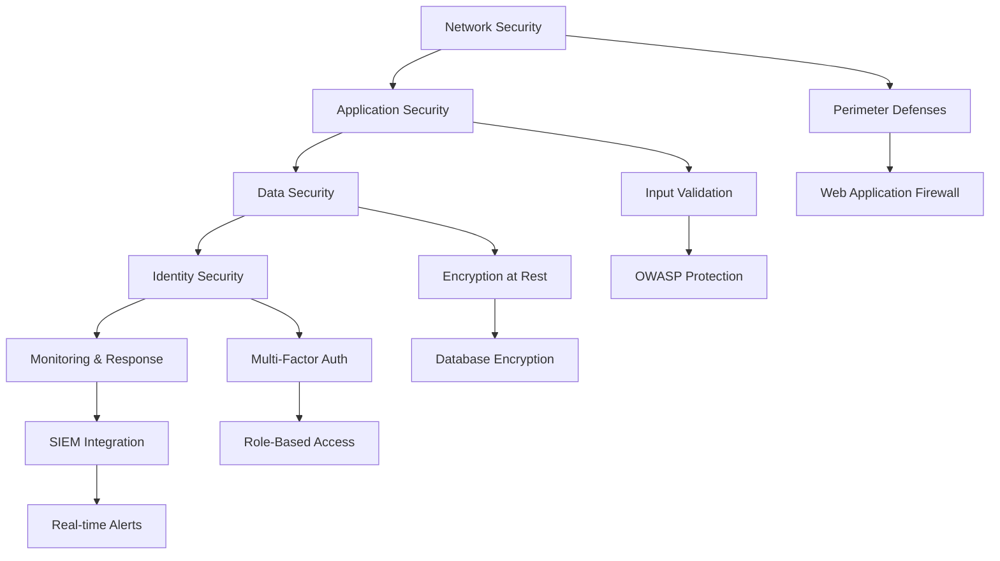

# TourTrip.app Güvenlik Kontratları

## Genel Bakış

Bu dokümantasyon, TourTrip.app platformunun güvenlik gereksinimlerini, protokollerini ve standartlarını kapsamlı şekilde tanımlar. Güvenlik **"Security by Design"** prensibi ile sistemin her katmanına entegre edilmiştir.

## Güvenlik İlkeleri

### 1. Zero Trust Architecture

**"Never trust, always verify"** prensibi uygulanır:

```typescript
// Zero Trust implementation
const ZERO_TRUST_PRINCIPLES = {
  verifyExplicitly: true,        // Her erişim açıkça doğrulanır
  useLeastPrivilege: true,       // En düşük yetki prensibi
  assumeBreach: true,            // İhlal varsayımı ile tasarım
  authenticateEverything: true,  // Her şey kimlik doğrulaması gerektirir
  authorizeEverything: true,     // Her eylem yetkilendirilir
  encryptEverything: true,       // Tüm veriler şifrelenir
  monitorEverything: true        // Tüm aktiviteler izlenir
};
```

### 2. Defense in Depth

Çok katmanlı güvenlik yaklaşımı:



## Kimlik Doğrulama ve Yetkilendirme

### Authentication Standards

#### 1. Password Security
```typescript
// Şifre politikası
const PASSWORD_POLICY = {
  requirements: {
    minLength: 8,
    maxLength: 128,
    requireUppercase: true,
    requireLowercase: true,
    requireNumbers: true,
    requireSpecialChars: true,
    preventCommonPasswords: true,
    preventPersonalInfo: true
  },

  validation: {
    entropy: 60,              // Minimum entropy bits
    dictionaryCheck: true,    // Common passwords kontrolü
    breachedCheck: true       // HaveIBeenPwned API kontrolü
  },

  storage: {
    algorithm: 'Argon2id',    // Önerilen şifreleme algoritması
    saltLength: 32,           // Salt uzunluğu
    hashLength: 64,           // Hash uzunluğu
    iterations: 4,            // Iteration sayısı
    memory: 19456,            // Memory kullanımı (KB)
    parallelism: 1            // Paralellik seviyesi
  }
};
```

#### 2. Multi-Factor Authentication (MFA)

**Desteklenen MFA Yöntemleri:**
```typescript
const MFA_METHODS = {
  sms: {
    enabled: true,
    rateLimit: '3 SMS per hour',
    backupCodes: true,
    internationalSupport: true
  },

  totp: {
    enabled: true,
    standard: 'RFC 6238',      // TOTP standardı
    backupCodes: true,
    appSupport: ['Google Authenticator', 'Authy', 'Microsoft Authenticator']
  },

  email: {
    enabled: true,
    rateLimit: '5 emails per hour',
    backupCodes: true,
    template: 'secure_otp_email'
  },

  hardware: {
    enabled: false,            // Gelecekte desteklenecek
    standards: ['FIDO2', 'WebAuthn']
  }
};
```

#### 3. Session Management

```typescript
// Session güvenlik konfigürasyonu
const SESSION_SECURITY = {
  jwt: {
    algorithm: 'RS256',
    issuer: 'tourtrip.app',
    audience: 'tourtrip-users',
    expiration: {
      accessToken: '1 hour',
      refreshToken: '30 days',
      rememberMe: '90 days'
    },
    rotation: {
      enabled: true,
      window: '5 minutes'      // Token rotation penceresi
    }
  },

  security: {
    httpOnly: true,
    secure: true,
    sameSite: 'strict',
    domain: '.tourtrip.app'
  },

  monitoring: {
    maxConcurrentSessions: 3,
    sessionTimeout: '24 hours',
    suspiciousActivityDetection: true
  }
};
```

### Authorization Framework

#### Role-Based Access Control (RBAC)

```typescript
// Rol tanımları ve izinleri
const ROLE_PERMISSIONS = {
  user: {
    resources: [
      'own_profile',
      'own_bookings',
      'own_payments',
      'own_reviews',
      'public_tours'
    ],
    actions: ['read', 'create', 'update', 'delete'],
    conditions: ['resource.owner == user.id']
  },

  tour_operator: {
    resources: [
      'own_tours',
      'own_bookings',
      'own_earnings',
      'own_analytics',
      'public_content'
    ],
    actions: ['read', 'create', 'update', 'delete', 'manage'],
    conditions: ['resource.providerId == user.providerId']
  },

  admin: {
    resources: ['*'],
    actions: ['*'],
    conditions: []
  },

  moderator: {
    resources: [
      'reviews',
      'user_reports',
      'content_moderation'
    ],
    actions: ['read', 'update', 'moderate'],
    conditions: []
  }
};
```

## Veri Güvenliği

### Encryption Standards

#### 1. Data at Rest Encryption

```typescript
// Veri şifreleme standartları
const DATA_ENCRYPTION = {
  database: {
    algorithm: 'AES-256-GCM',
    keySize: 256,
    keyRotation: '90 days',
    backupEncryption: true
  },

  fileStorage: {
    algorithm: 'AES-256-GCM',
    keyManagement: 'KMS',
    accessLogging: true,
    versioning: true
  },

  backups: {
    algorithm: 'AES-256-GCM',
    keyRotation: '30 days',
    multiRegion: true,
    immutable: true
  }
};
```

#### 2. Data in Transit Encryption

```typescript
// Transit şifreleme gereksinimleri
const TRANSIT_ENCRYPTION = {
  tls: {
    version: '1.3',
    cipherSuites: [
      'TLS_AES_128_GCM_SHA256',
      'TLS_AES_256_GCM_SHA384',
      'TLS_CHACHA20_POLY1305_SHA256'
    ],
    certificate: {
      authority: 'DigiCert',
      validity: '90 days',
      autoRenewal: true,
      pinning: true
    }
  },

  apiCommunications: {
    mTLS: true,              // Mutual TLS
    certificateValidation: true,
    hostnameVerification: true
  },

  databaseConnections: {
    sslMode: 'require',
    sslCompression: false,
    sslRenegotiation: false
  }
};
```

### Data Classification

```typescript
// Veri sınıflandırma seviyeleri
const DATA_CLASSIFICATION = {
  public: {
    level: 1,
    encryption: 'none',
    retention: 'indefinite',
    examples: ['tour_descriptions', 'public_reviews', 'location_data']
  },

  internal: {
    level: 2,
    encryption: 'at_rest',
    retention: '7 years',
    examples: ['user_preferences', 'booking_history', 'analytics_data']
  },

  confidential: {
    level: 3,
    encryption: 'at_rest_and_transit',
    retention: '5 years',
    examples: ['payment_methods', 'identity_documents', 'financial_reports']
  },

  restricted: {
    level: 4,
    encryption: 'end_to_end',
    retention: '3 years',
    access: 'need_to_know',
    examples: ['encryption_keys', 'audit_logs', 'security_events']
  }
};
```

## API Güvenliği

### Input Validation

```typescript
// Girdi doğrulama kuralları
const INPUT_VALIDATION = {
  sanitization: {
    htmlEscape: true,
    sqlInjectionPrevention: true,
    xssPrevention: true,
    commandInjectionPrevention: true
  },

  schemaValidation: {
    library: 'Zod',
    strictMode: true,
    errorReporting: 'detailed',
    customValidators: true
  },

  rateLimiting: {
    window: '15 minutes',
    maxRequests: {
      authenticated: 1000,
      anonymous: 100,
      admin: 5000
    },
    burstLimit: 50
  },

  fileUpload: {
    maxSize: '10MB',
    allowedTypes: [
      'image/jpeg',
      'image/png',
      'image/webp',
      'application/pdf'
    ],
    virusScanning: true,
    contentValidation: true
  }
};
```

### API Security Headers

```typescript
// Güvenlik header'ları
const SECURITY_HEADERS = {
  'Content-Security-Policy': `
    default-src 'self';
    script-src 'self' 'unsafe-inline' 'unsafe-eval';
    style-src 'self' 'unsafe-inline';
    img-src 'self' data: https:;
    font-src 'self';
    connect-src 'self' https://api.tourtrip.app;
    frame-ancestors 'none';
    form-action 'self';
    upgrade-insecure-requests;
  `,

  'Strict-Transport-Security': 'max-age=31536000; includeSubDomains; preload',

  'X-Content-Type-Options': 'nosniff',

  'X-Frame-Options': 'DENY',

  'X-XSS-Protection': '1; mode=block',

  'Referrer-Policy': 'strict-origin-when-cross-origin',

  'Permissions-Policy': `
    camera=(),
    microphone=(),
    geolocation=(self),
    payment=(self),
    usb=()
  `
};
```

## Payment Security (PCI DSS)

### Payment Card Industry Compliance

```typescript
// PCI DSS gereksinimleri
const PCI_COMPLIANCE = {
  cardholderData: {
    storage: 'prohibited',       // Kart verisi saklanmaz
    transmission: 'encrypted',   // Şifreli transmission
    processing: 'tokenized',     // Tokenization kullanımı
    retention: 'none'            // Veri saklanmaz
  },

  networkSecurity: {
    firewall: 'enabled',
    intrusionDetection: 'active',
    vulnerabilityManagement: 'monthly_scans',
    accessControls: 'need_to_know'
  },

  monitoring: {
    logRetention: '1 year',
    logAnalysis: 'real_time',
    incidentResponse: '24/7',
    forensicReadiness: true
  },

  compliance: {
    selfAssessment: 'annual',
    externalAudit: 'annual',
    remediation: '90_days',
    reporting: 'immediate'
  }
};
```

## Infrastructure Security

### Network Security

```typescript
// Ağ güvenliği konfigürasyonu
const NETWORK_SECURITY = {
  vpc: {
    isolated: true,
    subnets: {
      public: ['web_tier'],
      private: ['app_tier', 'data_tier'],
      restricted: ['admin_tier']
    },
    securityGroups: [
      {
        name: 'web-tier',
        inbound: [
          { protocol: 'tcp', port: 80, source: '0.0.0.0/0' },
          { protocol: 'tcp', port: 443, source: '0.0.0.0/0' }
        ],
        outbound: [
          { protocol: 'tcp', port: 5432, destination: 'data-tier' },
          { protocol: 'tcp', port: 6379, destination: 'data-tier' }
        ]
      }
    ]
  },

  waf: {
    enabled: true,
    rules: [
      'sql_injection_protection',
      'xss_protection',
      'rate_limiting',
      'geo_blocking',
      'bot_protection'
    ],
    customRules: [
      {
        name: 'suspicious_user_agents',
        action: 'block',
        conditions: ['bot_patterns', 'scanner_signatures']
      }
    ]
  },

  ddos: {
    protection: 'enabled',
    mitigation: 'automatic',
    thresholds: {
      requestsPerSecond: 10000,
      bandwidthMbps: 1000
    }
  }
};
```

## Access Control

### Identity and Access Management

```typescript
// IAM politikaları
const IAM_POLICIES = {
  users: {
    authentication: 'required',
    mfa: 'recommended',
    passwordExpiry: '90 days',
    sessionTimeout: '8 hours'
  },

  administrators: {
    authentication: 'required',
    mfa: 'enforced',
    privilegedAccess: 'justified',
    accessReview: 'quarterly'
  },

  serviceAccounts: {
    keyRotation: '30 days',
    leastPrivilege: true,
    temporaryCredentials: true,
    auditLogging: true
  },

  apiKeys: {
    rotation: '90 days',
    scopeLimiting: true,
    rateLimiting: true,
    expiration: true
  }
};
```

## Monitoring ve Incident Response

### Security Monitoring

```typescript
// Güvenlik izleme konfigürasyonu
const SECURITY_MONITORING = {
  siem: {
    integration: 'enabled',
    retention: '13 months',
    realTimeAnalysis: true,
    correlationRules: [
      'multiple_failed_logins',
      'suspicious_ip_activity',
      'data_exfiltration_attempts',
      'privilege_escalation'
    ]
  },

  logging: {
    level: 'info',             // Normal operasyonlar
    securityLevel: 'debug',    // Güvenlik event'ları
    retention: {
      applicationLogs: '30 days',
      securityLogs: '1 year',
      auditLogs: '7 years'
    },
    encryption: true,
    integrity: true
  },

  alerting: {
    channels: ['email', 'sms', 'slack', 'pager'],
    escalation: {
      p1: 'immediate',         // Kritik güvenlik olayları
      p2: '15 minutes',        // Yüksek öncelik
      p3: '1 hour',           // Orta öncelik
      p4: '4 hours'           // Düşük öncelik
    }
  }
};
```

### Incident Response Plan

```typescript
// Olay müdahale süreci
const INCIDENT_RESPONSE = {
  phases: [
    'identification',     // Olay tespiti
    'containment',        // Yayılma önleme
    'eradication',        // Kök neden temizleme
    'recovery',          // Sistem geri yükleme
    'lessons_learned'    // Öğrenilen dersler
  ],

  roles: {
    incidentCoordinator: 'security_lead',
    technicalLead: 'devops_lead',
    communicationsLead: 'pr_manager',
    legalAdvisor: 'legal_team'
  },

  procedures: {
    dataBreach: {
      notification: '72 hours (GDPR)',
      affectedUsers: 'individual_notification',
      authorities: 'immediate_reporting',
      remediation: 'credit_monitoring'
    },

    paymentFraud: {
      containment: 'immediate_card_blocking',
      investigation: 'transaction_analysis',
      recovery: 'chargeback_processing',
      prevention: 'fraud_rules_update'
    }
  }
};
```

## Compliance ve Standards

### Regulatory Compliance

#### GDPR (General Data Protection Regulation)

```typescript
// GDPR uyumluluk gereksinimleri
const GDPR_COMPLIANCE = {
  dataProcessing: {
    lawfulBasis: [
      'consent',           // Kullanıcı rızası
      'contract',          // Sözleşme gereği
      'legal_obligation',  // Yasal yükümlülük
      'vital_interests',   // Hayati menfaatler
      'public_task',       // Kamu görevi
      'legitimate_interests' // Meşru menfaatler
    ],
    dataMinimization: true,
    purposeLimitation: true,
    storageLimitation: true
  },

  userRights: {
    access: 'enabled',           // Veri erişim hakkı
    rectification: 'enabled',    // Düzeltme hakkı
    erasure: 'enabled',         // Silme hakkı
    portability: 'enabled',     // Veri taşınabilirliği
    restriction: 'enabled',     // İşleme kısıtlama
    objection: 'enabled'        // İtiraz hakkı
  },

  consent: {
    granular: true,             // Detaylı rıza seçenekleri
    withdrawable: true,         // Geri çekilebilir
    documented: true,           // Kayıt altına alınmış
    childConsent: 'parental'    // Çocuk verisi için ebeveyn rızası
  }
};
```

#### KVKK (Kişisel Verileri Koruma Kanunu)

```typescript
// KVKK uyumluluk gereksinimleri
const KVKK_COMPLIANCE = {
  dataController: {
    registration: 'required',   // VERBİS kaydı
    notification: 'obligatory', // Veri ihlali bildirimi
    security: 'adequate',       // Uygun güvenlik önlemleri
    retention: 'limited'        // Sınırlı saklama süresi
  },

  dataSubjects: {
    information: 'transparent', // Şeffaf bilgilendirme
    consent: 'explicit',        // Açık rıza
    rights: 'full_implementation', // Tüm hakların uygulanması
    complaint: 'easy_access'    // Kolay şikayet mekanizması
  },

  localization: {
    dataResidency: 'tr_eu',     // Türkiye/AB veri residency
    crossBorder: 'safeguards',  // Sınır ötesi transfer korumaları
    adequacy: 'maintained'      // Yeterlilik kararları
  }
};
```

### Security Standards

#### OWASP Top 10 Coverage

```typescript
// OWASP Top 10 koruma önlemleri
const OWASP_PROTECTION = {
  'A01:2021-Broken Access Control': {
    implemented: true,
    measures: ['rbac', 'authorization_middleware', 'input_validation']
  },

  'A02:2021-Cryptographic Failures': {
    implemented: true,
    measures: ['tls_1_3', 'data_encryption', 'key_rotation']
  },

  'A03:2021-Injection': {
    implemented: true,
    measures: ['prepared_statements', 'input_sanitization', 'orm_usage']
  },

  'A04:2021-Insecure Design': {
    implemented: true,
    measures: ['threat_modeling', 'secure_architecture', 'security_testing']
  },

  'A05:2021-Security Misconfiguration': {
    implemented: true,
    measures: ['hardened_configuration', 'automated_scanning', 'secure_headers']
  },

  'A06:2021-Vulnerable Components': {
    implemented: true,
    measures: ['dependency_scanning', 'patch_management', 'sbom']
  },

  'A07:2021-Identification/Authentication Failures': {
    implemented: true,
    measures: ['mfa', 'password_policies', 'session_management']
  },

  'A08:2021-Software/Data Integrity Failures': {
    implemented: true,
    measures: ['code_signing', 'supply_chain_security', 'integrity_checks']
  },

  'A09:2021-Security Logging/ Monitoring Failures': {
    implemented: true,
    measures: ['comprehensive_logging', 'real_time_monitoring', 'alerting']
  },

  'A10:2021-Server-Side Request Forgery': {
    implemented: true,
    measures: ['url_validation', 'network_segmentation', 'allow_list']
  }
};
```

## Security Testing

### Automated Security Testing

```typescript
// Güvenlik test stratejisi
const SECURITY_TESTING = {
  sast: {
    tools: ['ESLint Security', 'SonarQube', 'Checkov'],
    coverage: '100%',
    frequency: 'every_commit',
    blocking: true
  },

  dast: {
    tools: ['OWASP ZAP', 'Burp Suite', 'Postman Security'],
    scope: 'all_api_endpoints',
    frequency: 'daily',
    authentication: 'required'
  },

  dependencyScanning: {
    tools: ['npm audit', 'Snyk', 'OWASP Dependency-Check'],
    frequency: 'daily',
    autoRemediation: false,
    blocking: true
  },

  penetrationTesting: {
    frequency: 'quarterly',
    methodology: 'OSSTMM',
    scope: 'full_application',
    reporting: 'detailed_with_remediation'
  }
};
```

### Security Code Review

```typescript
// Güvenlik kod inceleme checklist'i
const SECURITY_REVIEW_CHECKLIST = [
  'authentication_implementation',
  'authorization_checks',
  'input_validation',
  'output_encoding',
  'error_handling',
  'logging_sensitivity',
  'crypto_usage',
  'session_management',
  'csrf_protection',
  'https_enforcement',
  'header_security',
  'dependency_security'
];
```

## Risk Management

### Threat Modeling

```typescript
// Tehdit modelleme metodolojisi
const THREAT_MODELING = {
  methodology: 'STRIDE',
  categories: {
    spoofing: 'authentication_breaches',
    tampering: 'data_integrity_attacks',
    repudiation: 'non_repudiation_failures',
    informationDisclosure: 'data_leaks',
    denialOfService: 'availability_attacks',
    elevationOfPrivilege: 'authorization_bypasses'
  },

  assets: [
    'user_data',
    'payment_information',
    'booking_data',
    'provider_credentials',
    'api_keys',
    'encryption_keys'
  ],

  entryPoints: [
    'web_application',
    'mobile_apps',
    'admin_panel',
    'api_endpoints',
    'third_party_integrations'
  ]
};
```

### Risk Assessment

```typescript
// Risk değerlendirme matrisi
interface RiskAssessment {
  threat: string;
  asset: string;
  likelihood: 'very_low' | 'low' | 'medium' | 'high' | 'very_high';
  impact: 'very_low' | 'low' | 'medium' | 'high' | 'very_high';
  riskLevel: 'low' | 'medium' | 'high' | 'critical';

  // Risk seviyesi hesaplama
  calculateRiskLevel(likelihood: string, impact: string): string {
    const riskMatrix = {
      'very_low': { 'very_low': 'low', 'low': 'low', 'medium': 'low', 'high': 'medium', 'very_high': 'medium' },
      'low': { 'very_low': 'low', 'low': 'low', 'medium': 'medium', 'high': 'medium', 'very_high': 'high' },
      'medium': { 'very_low': 'low', 'low': 'medium', 'medium': 'medium', 'high': 'high', 'very_high': 'high' },
      'high': { 'very_low': 'medium', 'low': 'medium', 'medium': 'high', 'high': 'critical', 'very_high': 'critical' },
      'very_high': { 'very_low': 'medium', 'low': 'high', 'medium': 'high', 'high': 'critical', 'very_high': 'critical' }
    };

    return riskMatrix[likelihood]?.[impact] || 'unknown';
  }
}
```

Bu güvenlik kontratları, TourTrip.app'in güvenlik standartlarını ve gereksinimlerini kapsamlı şekilde tanımlar.
