# TourTrip.app Servis Kontratları

## Genel Bakış

Bu dokümantasyon, TourTrip.app'in mikroservis mimarisindeki servisler arası iletişim protokollerini, event'ları ve servis sınırlarını tanımlar. Sistem **15+ bağımsız mikroservis** ve **event-driven architecture** kullanır.

## Mikroservis Mimarisi

### Servis Dağılımı

```mermaid
graph TB
    API[API Gateway] --> Auth[Auth Service]
    API --> User[User Service]
    API --> Provider[Provider Service]
    API --> Booking[Booking Service]
    API --> Payment[Payment Service]
    API --> Notification[Notification Service]
    API --> Search[Search Service]
    API --> Review[Review Service]
    API --> Taxi[Taxi Service]
    API --> Loyalty[Loyalty Service]
    API --> Admin[Admin Service]
    API --> Marketplace[Marketplace Service]
    API --> TripPlanner[Trip Planner Service]
    API --> AIAssistant[AI Assistant Service]
    API --> AddOn[Add-on Service]
    API --> Insurance[Insurance Service]

    Auth --> UserDB[(User Database)]
    User --> UserDB
    Provider --> ProviderDB[(Provider Database)]
    Booking --> BookingDB[(Booking Database)]
    Payment --> PaymentDB[(Payment Database)]
    Review --> ReviewDB[(Review Database)]
    Taxi --> TaxiDB[(Taxi Database)]
    Loyalty --> LoyaltyDB[(Loyalty Database)]
    Marketplace --> MarketplaceDB[(Marketplace Database)]
    TripPlanner --> TripDB[(Trip Database)]
    AIAssistant --> ConversationDB[(Conversation Database)]
    AddOn --> AddOnDB[(Add-on Database)]
    Insurance --> InsuranceDB[(Insurance Database)]

    Search --> SearchEngine[Search Engine]
    Notification --> PushService[Push Notification Service]
    Notification --> EmailService[Email Service]
    Notification --> SMSService[SMS Service]
    TripPlanner --> GoogleMapsAPI[Google Maps API]
    AIAssistant --> NLPEngine[NLP Engine]
```



## Servis Sorumlulukları ve Sınırları

### 1. Authentication Service (`auth-service`)

**Sorumlulukları:**
- Kullanıcı kimlik doğrulaması
- JWT token yönetimi
- Çok faktörlü kimlik doğrulama
- Şifre sıfırlama akışları

**API Endpoints:**
```typescript
// Kimlik doğrulama endpoints
POST   /auth/login              // Kullanıcı girişi
POST   /auth/register           // Kullanıcı kaydı
POST   /auth/logout             // Çıkış
POST   /auth/refresh            // Token yenileme
POST   /auth/forgot-password    // Şifre sıfırlama
POST   /auth/reset-password     // Şifre sıfırlama
POST   /auth/verify-email       // Email doğrulama
POST   /auth/verify-phone       // Telefon doğrulama
POST   /auth/mfa/setup          // MFA kurulumu
POST   /auth/mfa/verify         // MFA doğrulama
```

**Event'ları Yayınlar:**
```typescript
// Auth events
{
  type: 'user.logged_in',
  data: { userId: string, timestamp: string }
}

{
  type: 'user.registered',
  data: { userId: string, email: string, timestamp: string }
}

{
  type: 'user.password_changed',
  data: { userId: string, timestamp: string }
}
```

### 2. User Service (`user-service`)

**Sorumlulukları:**
- Kullanıcı profil yönetimi
- Kullanıcı tercihleri
- Kullanıcı aktivite takibi
- Kullanıcı veri analitiği

**API Endpoints:**
```typescript
// Profil yönetimi
GET    /users/profile           // Profil bilgileri
PUT    /users/profile           // Profil güncelleme
PUT    /users/preferences       // Tercih güncelleme
GET    /users/activity          // Aktivite geçmişi
PUT    /users/avatar            // Profil fotoğrafı yükleme

// Sadakat programı
GET    /users/loyalty           // Sadakat bilgileri
POST   /users/loyalty/earn      // Puan kazanma
POST   /users/loyalty/redeem    // Puan harcama
```

**Event'ları Dinler:**
- `booking.completed`
- `payment.succeeded`
- `review.created`

**Event'ları Yayınlar:**
```typescript
{
  type: 'user.profile_updated',
  data: { userId: string, fields: string[], timestamp: string }
}

{
  type: 'user.loyalty_updated',
  data: { userId: string, points: number, tier: string }
}
```

### 3. Provider Service (`provider-service`)

**Sorumlulukları:**
- Sağlayıcı kayıt ve doğrulama
- Sağlayıcı profil yönetimi
- Sağlayıcı analitiği
- Sağlayıcı komisyon hesaplaması

**API Endpoints:**
```typescript
// Sağlayıcı yönetimi
POST   /providers/register      // Sağlayıcı kaydı
GET    /providers/profile       // Profil bilgileri
PUT    /providers/profile       // Profil güncelleme
GET    /providers/verification  // Doğrulama durumu
PUT    /providers/verification  // Doğrulama belgesi yükleme

// Finansal yönetim
GET    /providers/earnings      // Kazanç raporu
GET    /providers/payouts       // Ödeme geçmişi
POST   /providers/payout/request // Ödeme talebi
```

**Event'ları Dinler:**
- `booking.confirmed`
- `payment.succeeded`
- `review.created`

**Event'ları Yayınlar:**
```typescript
{
  type: 'provider.registered',
  data: { providerId: string, category: string, timestamp: string }
}

{
  type: 'provider.verified',
  data: { providerId: string, verificationLevel: string }
}
```

### 4. Booking Service (`booking-service`)

**Sorumlulukları:**
- Rezervasyon oluşturma ve yönetimi
- Kapasite kontrolü
- Grup rezervasyonları
- Çoklu servis rezervasyonları

**API Endpoints:**
```typescript
// Rezervasyon işlemleri
POST   /bookings                // Rezervasyon oluşturma
GET    /bookings                // Rezervasyon listesi
GET    /bookings/{id}           // Rezervasyon detayı
PUT    /bookings/{id}/status    // Rezervasyon durumu güncelleme
POST   /bookings/{id}/cancel    // Rezervasyon iptali

// Grup rezervasyonları
POST   /group-bookings          // Grup rezervasyonu oluşturma
GET    /group-bookings/{id}     // Grup detayı
PUT    /group-bookings/{id}     // Grup güncelleme

// Kapasite kontrolü
GET    /availability/{tourId}   // Müsaitlik kontrolü
```

**Event'ları Dinler:**
- `payment.succeeded`
- `payment.failed`
- `tour.availability_changed`

**Event'ları Yayınlar:**
```typescript
{
  type: 'booking.created',
  data: { bookingId: string, tourId: string, userId: string }
}

{
  type: 'booking.confirmed',
  data: { bookingId: string, amount: number, currency: string }
}

{
  type: 'booking.cancelled',
  data: { bookingId: string, reason: string, refundAmount: number }
}
```

### 5. Payment Service (`payment-service`)

**Sorumlulukları:**
- Ödeme işleme
- Komisyon hesaplaması
- İade yönetimi
- Finansal raporlama

**API Endpoints:**
```typescript
// Ödeme işlemleri
POST   /payments/create-intent  // Ödeme intent oluşturma
GET    /payments/{id}           // Ödeme detayı
POST   /payments/refund         // İade işlemi

// Finansal raporlar
GET    /payments/reports        // Finansal raporlar
GET    /payments/commissions    // Komisyon raporu
```

**Event'ları Dinler:**
- `booking.confirmed`

**Event'ları Yayınlar:**
```typescript
{
  type: 'payment.succeeded',
  data: { paymentId: string, bookingId: string, amount: number }
}

{
  type: 'payment.failed',
  data: { paymentId: string, bookingId: string, reason: string }
}

{
  type: 'refund.processed',
  data: { paymentId: string, refundId: string, amount: number }
}
```

### 6. Search Service (`search-service`)

**Sorumlulukları:**
- Elasticsearch ile arama
- Filtreleme ve sıralama
- Öneri algoritması
- Arama analitiği

**API Endpoints:**
```typescript
// Arama işlemleri
GET    /search                  // Genel arama
GET    /search/tours            // Tur arama
GET    /search/suggestions      // Öneri arama
POST   /search/track            // Arama takibi

// Filtreleme
GET    /filters/categories      // Kategori filtreleri
GET    /filters/locations       // Konum filtreleri
```

**Event'ları Dinler:**
- `tour.created`
- `tour.updated`
- `review.created`

**Event'ları Yayınlar:**
```typescript
{
  type: 'search.performed',
  data: { query: string, results: number, filters: object }
}
```

## Event-Driven Architecture

### Event Yapısı

```typescript
interface Event {
  id: string;                    // Benzersiz event ID'si
  type: string;                  // Event tipi
  source: string;                // Event kaynağı servis
  timestamp: string;             // ISO 8601 timestamp
  version: string;               // Event versiyonu

  data: Record<string, any>;     // Event verisi
  metadata?: {
    correlationId?: string;      // İlişkili işlemler için
    causationId?: string;       // Nedensellik zinciri
    userId?: string;            // İlgili kullanıcı
    requestId?: string;         // HTTP request ID'si
  };
}
```

### Event Türleri

#### Domain Event'ları
```typescript
// Booking domain events
{
  type: 'booking.lifecycle',
  data: {
    bookingId: string,
    status: 'created' | 'confirmed' | 'cancelled' | 'completed',
    previousStatus?: string,
    changedAt: string
  }
}

{
  type: 'booking.payment_required',
  data: {
    bookingId: string,
    amount: number,
    currency: string,
    dueDate: string
  }
}

// User domain events
{
  type: 'user.profile_completed',
  data: {
    userId: string,
    completionPercentage: number,
    missingFields: string[]
  }
}

// Provider domain events
{
  type: 'provider.qualified_for_featured',
  data: {
    providerId: string,
    qualificationCriteria: string[],
    effectiveDate: string
  }
}
```

#### Integration Event'ları
```typescript
// External service events
{
  type: 'payment.gateway.webhook',
  data: {
    gateway: 'stripe' | 'iyzico',
    eventType: string,
    payload: Record<string, any>
  }
}

{
  type: 'email.delivered',
  data: {
    emailId: string,
    recipient: string,
    deliveredAt: string,
    status: 'delivered' | 'bounced' | 'spam'
  }
}
```

### Event Publishing

```typescript
// Event publisher interface
interface EventPublisher {
  publish(event: Event, options?: {
    topic?: string;           // Event topic'i
    partitionKey?: string;    // Partition anahtarı
    headers?: Record<string, string>;
  }): Promise<void>;

  publishBatch(events: Event[]): Promise<void>;
}

// Örnek kullanım
await eventPublisher.publish({
  id: generateId(),
  type: 'booking.confirmed',
  source: 'booking-service',
  timestamp: new Date().toISOString(),
  data: {
    bookingId: 'booking_123',
    tourId: 'tour_456',
    userId: 'user_789',
    totalAmount: 299.99
  },
  metadata: {
    correlationId: 'corr_123',
    userId: 'user_789'
  }
}, {
  topic: 'bookings',
  partitionKey: 'booking_123'
});
```

### Event Subscription

```typescript
// Event subscriber interface
interface EventSubscriber {
  subscribe(
    eventTypes: string[],
    handler: (event: Event) => Promise<void>,
    options?: {
      topic?: string;
      groupId?: string;      // Consumer group
      autoCommit?: boolean;
    }
  ): Promise<void>;

  unsubscribe(subscriptionId: string): Promise<void>;
}

// Örnek subscription
await eventSubscriber.subscribe(
  ['booking.confirmed', 'payment.succeeded'],
  async (event) => {
    console.log('Event received:', event.type, event.data);

    // Event handler logic
    switch (event.type) {
      case 'booking.confirmed':
        await updateTourAvailability(event.data);
        await sendConfirmationEmail(event.data);
        break;
      case 'payment.succeeded':
        await updateBookingPaymentStatus(event.data);
        break;
    }
  },
  {
    topic: 'bookings',
    groupId: 'notification-service'
  }
);
```

## Servis İletişim Protokolleri

### 1. REST API İletişimi

**Standart HTTP Headers:**
```typescript
// Request headers
Authorization: Bearer <jwt_token>
Content-Type: application/json
X-Request-ID: req_1234567890
X-Correlation-ID: corr_0987654321
X-Source-Service: booking-service
User-Agent: TourTrip-BookingService/1.0

// Response headers
X-Request-ID: req_1234567890
X-Response-Time: 245ms
X-Service-Version: booking-service/2.1.0
```

**Error Response Format:**
```typescript
{
  success: false,
  error: {
    code: "BOOKING_NOT_FOUND",
    message: "Rezervasyon bulunamadı",
    details: {
      bookingId: "invalid_id"
    }
  },
  meta: {
    timestamp: "2023-12-15T10:30:00Z",
    requestId: "req_1234567890",
    service: "booking-service"
  }
}
```

### 2. Asynchronous Communication (Message Queue)

**Queue Yapılandırması:**
```typescript
// RabbitMQ/Kafka konfigürasyonu
const MESSAGE_QUEUE_CONFIG = {
  exchanges: {
    'tourtrip.events': {
      type: 'topic',
      durable: true
    }
  },

  queues: {
    'booking.events': {
      exchange: 'tourtrip.events',
      routingKey: 'booking.#',
      durable: true
    },
    'payment.events': {
      exchange: 'tourtrip.events',
      routingKey: 'payment.#',
      durable: true
    }
  },

  bindings: [
    {
      queue: 'booking.events',
      exchange: 'tourtrip.events',
      routingKey: 'booking.*'
    }
  ]
};
```

### 3. Service Discovery

**Servis Kayıt Formatı:**
```typescript
interface ServiceRegistration {
  serviceName: string;
  version: string;
  status: 'healthy' | 'unhealthy' | 'maintenance';
  endpoints: Array<{
    path: string;
    methods: string[];
    healthCheck?: string;
  }>;
  metadata: {
    description: string;
    owner: string;
    documentation: string;
    dependencies: string[];
  };
  registeredAt: string;
  lastHealthCheck: string;
}
```

## Data Consistency ve Transaction Management

### Distributed Transactions

**Saga Pattern Uygulaması:**
```typescript
// Booking creation saga
const BOOKING_SAGA = {
  steps: [
    {
      service: 'booking-service',
      action: 'create_booking',
      compensation: 'cancel_booking'
    },
    {
      service: 'inventory-service',
      action: 'reserve_spots',
      compensation: 'release_spots'
    },
    {
      service: 'notification-service',
      action: 'send_confirmation',
      compensation: 'send_cancellation'
    }
  ],

  timeout: 30000, // 30 saniye
  retryPolicy: {
    maxRetries: 3,
    backoffMultiplier: 2,
    initialDelay: 1000
  }
};
```

### Eventual Consistency

**Consistency Guarantees:**
```typescript
// Strong consistency gerektiren işlemler
const STRONG_CONSISTENCY_OPERATIONS = [
  'payment_processing',
  'booking_confirmation',
  'user_deletion'
];

// Eventual consistency kabul edilebilir işlemler
const EVENTUAL_CONSISTENCY_OPERATIONS = [
  'search_index_updates',
  'analytics_aggregation',
  'recommendation_updates'
];
```

## Service Level Agreements (SLA)

### Performans SLA'ları

| Servis | Response Time | Availability | Throughput |
|--------|---------------|--------------|------------|
| Auth Service | < 100ms | 99.9% | 1000 req/s |
| Booking Service | < 200ms | 99.9% | 500 req/s |
| Payment Service | < 500ms | 99.95% | 200 req/s |
| Search Service | < 100ms | 99.9% | 2000 req/s |

### Güvenilirlik SLA'ları

```typescript
// Error rate limits
const ERROR_RATE_LIMITS = {
  'auth-service': {
    maxErrorRate: 0.001, // %0.1 error rate
    monitoringWindow: '5 minutes',
    alertThreshold: 0.005 // %0.5'de alert
  },

  'payment-service': {
    maxErrorRate: 0.0001, // %0.01 error rate
    monitoringWindow: '1 minute',
    alertThreshold: 0.001
  }
};
```

## Monitoring ve Observability

### Health Checks

**Health Check Endpoints:**
```typescript
// Her servis için standart health check
GET /health

Response: {
  status: 'healthy' | 'unhealthy',
  timestamp: string,
  version: string,
  uptime: number,
  dependencies: {
    database: 'healthy' | 'unhealthy',
    messageQueue: 'healthy' | 'unhealthy',
    externalServices: Record<string, string>
  },
  metrics: {
    responseTime: number,
    errorRate: number,
    throughput: number
  }
}
```

### Metrics Collection

**Standart Metrikler:**
```typescript
interface ServiceMetrics {
  timestamp: string;
  serviceName: string;

  // Performance metrics
  responseTime: {
    average: number;
    p50: number;
    p95: number;
    p99: number;
  };

  // Reliability metrics
  errorRate: number;
  availability: number;

  // Business metrics
  throughput: number;
  activeConnections: number;

  // Resource metrics
  cpuUsage: number;
  memoryUsage: number;
  diskUsage: number;
}
```

## Deployment ve Scaling

### Container Konfigürasyonu

```yaml
# Docker Compose servis tanımı
version: '3.8'
services:
  booking-service:
    image: tourtrip/booking-service:v2.1.0
    environment:
      - DATABASE_URL=postgresql://...
      - MESSAGE_QUEUE_URL=amqp://...
      - REDIS_URL=redis://...
    deploy:
      replicas: 3
      resources:
        limits:
          cpus: '0.5'
          memory: 512M
        reservations:
          cpus: '0.25'
          memory: 256M
    healthcheck:
      test: ["CMD", "curl", "-f", "http://localhost:3000/health"]
      interval: 30s
      timeout: 10s
      retries: 3
```

### Auto-scaling Kuralları

```typescript
// Horizontal Pod Autoscaler konfigürasyonu
const HPA_CONFIG = {
  'booking-service': {
    minReplicas: 2,
    maxReplicas: 10,
    targetCPUUtilization: 70,
    targetMemoryUtilization: 80,
    scaleDownStabilizationWindow: 300, // 5 dakika
    scaleUpStabilizationWindow: 60     // 1 dakika
  },

  'search-service': {
    minReplicas: 3,
    maxReplicas: 15,
    targetCPUUtilization: 60,
    metrics: [
      {
        type: 'Resource',
        resource: 'cpu',
        target: { type: 'Utilization', averageUtilization: 60 }
      },
      {
        type: 'Pods',
        pods: { metric: 'requests_per_second', target: 1000 }
      }
    ]
  }
};
```

## Error Handling ve Resilience

### Circuit Breaker Pattern

```typescript
// Circuit breaker konfigürasyonu
const CIRCUIT_BREAKER_CONFIG = {
  'payment-service': {
    failureThreshold: 5,           // 5 başarısız çağrıdan sonra aç
    recoveryTimeout: 60000,        // 1 dakika sonra tekrar dene
    monitoringWindow: 10000,       // 10 saniyelik pencere
    successThreshold: 3            // 3 başarılı çağrıdan sonra kapat
  },

  'external-payment-gateway': {
    failureThreshold: 3,
    recoveryTimeout: 30000,
    monitoringWindow: 5000,
    successThreshold: 2
  }
};
```

### Retry Policies

```typescript
// Retry policy konfigürasyonu
const RETRY_POLICIES = {
  'database-operations': {
    maxRetries: 3,
    initialDelay: 1000,     // 1 saniye
    backoffMultiplier: 2,   // Exponential backoff
    maxDelay: 10000,        // Maksimum 10 saniye
    retryableErrors: ['CONNECTION_ERROR', 'TIMEOUT']
  },

  'external-api-calls': {
    maxRetries: 2,
    initialDelay: 2000,
    backoffMultiplier: 1.5,
    maxDelay: 5000,
    retryableErrors: ['TIMEOUT', 'RATE_LIMITED']
  }
};
```

## Security Contracts

### Service-to-Service Authentication

```typescript
// Service authentication
const SERVICE_AUTH = {
  method: 'JWT',
  issuer: 'tourtrip-platform',
  audience: 'tourtrip-services',
  algorithm: 'RS256',
  expiration: '5 minutes',
  claims: {
    serviceName: string,
    permissions: string[],
    environment: 'production' | 'staging' | 'development'
  }
};
```

### Data Access Control

```typescript
// Veri erişim kontrolü
const DATA_ACCESS_RULES = {
  'user-service': {
    canAccess: ['users', 'user_preferences', 'loyalty_data'],
    permissions: ['read', 'write'],
    filters: {
      'users': 'userId == currentUserId OR role == admin'
    }
  },

  'booking-service': {
    canAccess: ['bookings', 'tours', 'providers'],
    permissions: ['read', 'write'],
    filters: {
      'bookings': 'userId == currentUserId OR providerId == currentProviderId'
    }
  }
};
```

Bu servis kontratları, TourTrip.app'in mikroservisler arası tutarlı ve güvenli iletişimini sağlar.
