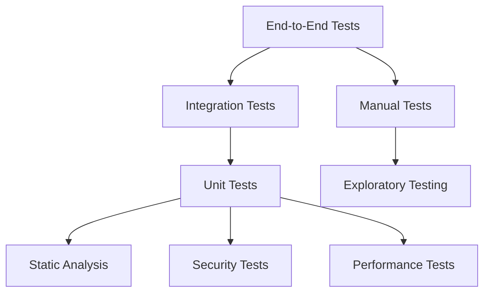

# TourTrip.app Test Kontratları

## Genel Bakış

Bu dokümantasyon, TourTrip.app platformunun test stratejilerini, kalite güvence süreçlerini ve test senaryolarını kapsamlı şekilde tanımlar. **Test-Driven Development (TDD)** ve **Behavior-Driven Development (BDD)** prensipleri uygulanır.

## Test Stratejisi

### Test Piramidi



### Test Kategorileri

#### 1. Unit Tests (Birim Testleri)
```typescript
// Unit test kapsamı
const UNIT_TEST_COVERAGE = {
  target: 90,                    // Minimum %90 kod kapsamı
  branches: 85,                  // Branch coverage
  functions: 95,                 // Function coverage
  lines: 90,                     // Line coverage
  statements: 90                 // Statement coverage
};

const UNIT_TEST_TYPES = {
  functions: 'pure_functions',
  classes: 'isolated_classes',
  utilities: 'helper_functions',
  hooks: 'react_hooks',
  components: 'presentational_components'
};
```

#### 2. Integration Tests (Entegrasyon Testleri)
```typescript
// Entegrasyon test kapsamı
const INTEGRATION_TEST_SCOPE = {
  apiEndpoints: 'all_endpoints',
  databaseOperations: 'crud_operations',
  externalServices: 'payment_gateways',
  fileStorage: 'upload_download',
  authentication: 'login_logout',
  authorization: 'role_permissions'
};
```

#### 3. End-to-End Tests (Uçtan Uca Testler)
```typescript
// E2E test senaryoları
const E2E_TEST_SCENARIOS = {
  userJourneys: [
    'complete_booking_flow',
    'user_registration_verification',
    'payment_processing',
    'group_booking_management'
  ],

  criticalPaths: [
    'booking_confirmation',
    'payment_security',
    'data_consistency',
    'error_recovery'
  ],

  edgeCases: [
    'network_failures',
    'concurrent_bookings',
    'data_corruption',
    'malicious_inputs'
  ]
};
```

## Test Framework'leri ve Araçları

### Frontend Testing

```typescript
// React/TypeScript test konfigürasyonu
const FRONTEND_TESTING = {
  unit: {
    framework: 'Vitest',
    libraries: ['@testing-library/react', '@testing-library/jest-dom'],
    coverage: ['istanbul', 'c8'],
    mocking: ['msw', 'jest-mock']
  },

  e2e: {
    framework: 'Playwright',
    browsers: ['chromium', 'firefox', 'webkit'],
    mobile: true,
    accessibility: true
  },

  integration: {
    framework: 'Vitest',
    apiMocking: 'msw',
    database: 'test_database'
  }
};
```

### Backend Testing

```typescript
// Node.js/Firebase test konfigürasyonu
const BACKEND_TESTING = {
  unit: {
    framework: 'Jest',
    mocking: ['jest-mock', 'firebase-mock'],
    coverage: 'nyc',
    database: 'memory_database'
  },

  integration: {
    framework: 'Jest',
    database: 'test_firestore',
    externalServices: 'mock_servers',
    apiTesting: 'supertest'
  },

  loadTesting: {
    tools: ['Artillery', 'k6'],
    scenarios: ['peak_booking', 'payment_stress', 'search_load']
  }
};
```

### Mobile Testing

```typescript
// Kotlin Multiplatform mobile test konfigürasyonu
const MOBILE_TESTING = {
  android: {
    unit: 'JUnit 5 + Mockito',
    integration: 'Espresso + Robolectric',
    e2e: 'UI Automator',
    performance: 'Android Profiler'
  },

  ios: {
    unit: 'XCTest',
    integration: 'XCTest UI',
    e2e: 'XCUITest',
    performance: 'Instruments'
  },

  shared: {
    unit: 'Kotlin Test',
    integration: 'Ktor Test',
    database: 'SQLDelight Test'
  }
};
```

## Test Senaryoları

### Authentication Test Cases

```typescript
// Kimlik doğrulama test senaryoları
const AUTH_TEST_CASES = {
  login: {
    validCredentials: {
      input: { email: 'user@test.com', password: 'SecurePass123!' },
      expected: { status: 200, token: 'jwt_token', user: 'user_data' }
    },

    invalidCredentials: {
      input: { email: 'user@test.com', password: 'wrong' },
      expected: { status: 401, error: 'INVALID_CREDENTIALS' }
    },

    bruteForce: {
      scenario: 'multiple_failed_attempts',
      expected: { status: 429, lockout: true, duration: '15_minutes' }
    },

    mfaVerification: {
      input: { token: '123456', method: 'sms' },
      expected: { status: 200, mfaVerified: true }
    }
  },

  registration: {
    validData: {
      input: {
        email: 'newuser@test.com',
        password: 'SecurePass123!',
        firstName: 'John',
        lastName: 'Doe'
      },
      expected: { status: 201, user: 'created', emailSent: true }
    },

    duplicateEmail: {
      input: { email: 'existing@test.com' },
      expected: { status: 409, error: 'EMAIL_EXISTS' }
    },

    weakPassword: {
      input: { password: '123' },
      expected: { status: 400, error: 'WEAK_PASSWORD' }
    }
  }
};
```

### Booking Test Cases

```typescript
// Rezervasyon test senaryoları
const BOOKING_TEST_CASES = {
  tourBooking: {
    validBooking: {
      input: {
        tourId: 'tour_123',
        participants: [
          { name: 'John Doe', email: 'john@test.com' }
        ],
        selectedDate: '2024-01-20',
        paymentMethod: 'credit_card'
      },
      expected: { status: 201, booking: 'created', paymentRequired: true }
    },

    capacityExceeded: {
      scenario: 'booking_when_full',
      input: { tourId: 'full_tour', participants: 20 },
      expected: { status: 400, error: 'CAPACITY_EXCEEDED' }
    },

    pastDate: {
      input: { selectedDate: '2020-01-01' },
      expected: { status: 400, error: 'INVALID_DATE' }
    },

    paymentFailure: {
      scenario: 'booking_with_failed_payment',
      input: { paymentMethod: 'invalid_card' },
      expected: { status: 402, booking: 'cancelled' }
    }
  },

  groupBooking: {
    createGroup: {
      input: {
        tourId: 'tour_123',
        name: 'Company Trip',
        participants: [
          { name: 'Alice', email: 'alice@company.com' },
          { name: 'Bob', email: 'bob@company.com' }
        ]
      },
      expected: { status: 201, group: 'created', invitations: 'sent' }
    },

    joinGroup: {
      input: { groupId: 'group_123', token: 'invitation_token' },
      expected: { status: 200, participant: 'added' }
    }
  }
};
```

### Payment Test Cases

```typescript
// Ödeme test senaryoları
const PAYMENT_TEST_CASES = {
  cardPayment: {
    successfulPayment: {
      input: {
        amount: 299.99,
        currency: 'TRY',
        cardToken: 'card_token',
        bookingId: 'booking_123'
      },
      expected: { status: 200, payment: 'completed', webhook: 'sent' }
    },

    declinedCard: {
      input: { cardToken: 'declined_card' },
      expected: { status: 402, error: 'CARD_DECLINED' }
    },

    insufficientFunds: {
      input: { cardToken: 'insufficient_funds_card' },
      expected: { status: 402, error: 'INSUFFICIENT_FUNDS' }
    }
  },

  refund: {
    fullRefund: {
      input: { paymentId: 'payment_123', reason: 'customer_request' },
      expected: { status: 200, refund: 'processed', notification: 'sent' }
    },

    partialRefund: {
      input: { paymentId: 'payment_123', amount: 150, reason: 'partial_cancellation' },
      expected: { status: 200, refund: 'processed' }
    }
  }
};
```

### Search Test Cases

```typescript
// Arama test senaryoları
const SEARCH_TEST_CASES = {
  basicSearch: {
    query: { q: 'istanbul turu' },
    expected: { results: 'array', total: 'number', time: '<100ms' }
  },

  filteredSearch: {
    query: {
      q: 'kapadokya',
      category: 'adventure',
      minPrice: 100,
      maxPrice: 500,
      rating: 4
    },
    expected: { results: 'filtered_array', facets: 'categories' }
  },

  locationSearch: {
    query: {
      location: '41.0082,28.9784',
      radius: 10,
      unit: 'km'
    },
    expected: { results: 'nearby_tours', distance: 'calculated' }
  }
};
```

## Performance Testing

### Load Testing Scenarios

```typescript
// Yük testi senaryoları
const LOAD_TESTING = {
  normalLoad: {
    users: 100,
    duration: '5 minutes',
    rampUp: '30 seconds',
    metrics: {
      responseTime: '<200ms',
      errorRate: '<1%',
      throughput: '>50 req/s'
    }
  },

  peakLoad: {
    users: 1000,
    duration: '10 minutes',
    rampUp: '1 minute',
    spike: { users: 2000, duration: '30 seconds' },
    metrics: {
      responseTime: '<500ms',
      errorRate: '<5%',
      throughput: '>200 req/s'
    }
  },

  stressTest: {
    users: 5000,
    duration: '15 minutes',
    breakPoint: 'identify_limits',
    recovery: 'measure_recovery_time'
  }
};
```

### API Performance Tests

```typescript
// API performans testleri
const API_PERFORMANCE_TESTS = {
  endpoints: [
    {
      path: '/tours',
      method: 'GET',
      load: '100 concurrent users',
      expected: { p95: '<100ms', errorRate: '<1%' }
    },
    {
      path: '/bookings',
      method: 'POST',
      load: '50 concurrent users',
      expected: { p95: '<200ms', errorRate: '<1%' }
    },
    {
      path: '/payments/create-intent',
      method: 'POST',
      load: '20 concurrent users',
      expected: { p95: '<500ms', errorRate: '<1%' }
    }
  ],

  database: {
    queryPerformance: '<50ms average',
    connectionPool: 'adequate_for_load',
    indexing: 'optimized'
  }
};
```

## Security Testing

### Vulnerability Testing

```typescript
// Güvenlik açığı testleri
const VULNERABILITY_TESTS = {
  owaspTop10: {
    'A01:Broken Access Control': {
      tests: ['authorization_bypass', 'privilege_escalation', 'id_orchestration'],
      tools: ['Burp Suite', 'ZAP'],
      frequency: 'continuous'
    },

    'A02:Cryptographic Failures': {
      tests: ['ssl_tls_config', 'key_management', 'encryption_strength'],
      tools: ['SSL Labs', 'cipherscan'],
      frequency: 'monthly'
    },

    'A03:Injection': {
      tests: ['sql_injection', 'nosql_injection', 'command_injection'],
      tools: ['sqlmap', 'NoSQLmap'],
      frequency: 'continuous'
    }
  },

  penetrationTesting: {
    blackBox: {
      scope: 'external_interfaces',
      methodology: 'OSSTMM',
      frequency: 'quarterly'
    },

    whiteBox: {
      scope: 'source_code',
      methodology: 'SAST',
      frequency: 'every_release'
    }
  }
};
```

### Authentication Security Tests

```typescript
// Kimlik doğrulama güvenlik testleri
const AUTH_SECURITY_TESTS = {
  passwordSecurity: {
    strength: ['weak_password_rejection', 'common_password_blocking'],
    storage: ['hashing_algorithm', 'salt_usage', 'rainbow_table_resistance'],
    transmission: ['https_enforcement', 'secure_cookies']
  },

  sessionSecurity: {
    management: ['session_timeout', 'concurrent_sessions', 'secure_flags'],
    hijacking: ['token_rotation', 'fingerprinting', 'anomaly_detection']
  },

  mfa: {
    implementation: ['totp_standard', 'backup_codes', 'rate_limiting'],
    bypass: ['mfa_bypass_prevention', 'fallback_mechanisms']
  }
};
```

## Test Data Management

### Test Data Strategy

```typescript
// Test verisi yönetimi
const TEST_DATA_STRATEGY = {
  generation: {
    method: 'faker_library',
    localization: ['tr', 'en', 'de'],
    consistency: 'deterministic_seeds',
    volume: {
      unitTests: 'minimal',
      integrationTests: 'representative',
      e2eTests: 'comprehensive'
    }
  },

  isolation: {
    database: 'separate_test_database',
    storage: 'isolated_buckets',
    services: 'mocked_dependencies'
  },

  cleanup: {
    automatic: true,
    retention: '24 hours',
    rollback: 'transaction_rollback'
  }
};
```

### Test Fixtures

```typescript
// Test fixture örnekleri
const TEST_FIXTURES = {
  users: {
    regularUser: {
      id: 'user_123',
      email: 'test@example.com',
      role: 'user',
      preferences: { language: 'tr', currency: 'TRY' }
    },

    tourOperator: {
      id: 'provider_456',
      email: 'provider@example.com',
      role: 'tour_operator',
      verified: true
    },

    admin: {
      id: 'admin_789',
      email: 'admin@example.com',
      role: 'admin'
    }
  },

  tours: {
    activeTour: {
      id: 'tour_123',
      title: 'İstanbul Historical Tour',
      status: 'active',
      price: { amount: 299, currency: 'TRY' },
      capacity: { min: 2, max: 15 }
    },

    fullTour: {
      id: 'tour_456',
      title: 'Full Capacity Tour',
      status: 'active',
      bookingsCount: 15,
      capacity: { min: 1, max: 15 }
    }
  },

  bookings: {
    confirmedBooking: {
      id: 'booking_123',
      status: 'confirmed',
      paymentStatus: 'completed',
      totalAmount: { amount: 299, currency: 'TRY' }
    },

    pendingBooking: {
      id: 'booking_456',
      status: 'pending',
      paymentStatus: 'pending'
    }
  }
};
```

## Continuous Testing

### CI/CD Pipeline Integration

```typescript
// Sürekli test entegrasyonu
const CI_CD_TESTING = {
  commit: {
    preCommit: ['lint', 'type_check', 'unit_tests'],
    postCommit: ['security_scan', 'dependency_check']
  },

  pullRequest: {
    validation: ['unit_tests', 'integration_tests', 'security_tests'],
    qualityGates: ['coverage_>90%', 'no_security_vulnerabilities']
  },

  release: {
    preDeploy: ['e2e_tests', 'performance_tests', 'load_tests'],
    postDeploy: ['smoke_tests', 'monitoring_setup']
  },

  scheduled: {
    nightly: ['regression_tests', 'performance_benchmarks'],
    weekly: ['security_scans', 'accessibility_tests'],
    monthly: ['penetration_tests', 'compliance_audits']
  }
};
```

### Test Reporting

```typescript
// Test raporlama konfigürasyonu
const TEST_REPORTING = {
  formats: ['html', 'json', 'junit'],
  destinations: [
    'ci_dashboard',
    'test_management_tool',
    'email_notifications',
    'slack_channel'
  ],

  metrics: {
    coverage: ['line', 'branch', 'function', 'statement'],
    performance: ['response_time', 'throughput', 'error_rate'],
    quality: ['test_success_rate', 'flaky_tests', 'test_duration']
  },

  trends: {
    tracking: ['coverage_trends', 'performance_trends', 'quality_metrics'],
    alerts: ['coverage_drop', 'performance_degradation', 'test_failures']
  }
};
```

## Quality Gates

### Kalite Geçitleri

```typescript
// Kalite geçit tanımları
const QUALITY_GATES = {
  unitTests: {
    coverage: '>90%',
    successRate: '100%',
    noFailingTests: true,
    maxDuration: '5 minutes'
  },

  integrationTests: {
    successRate: '>95%',
    noBreakingChanges: true,
    apiCompatibility: true,
    maxDuration: '10 minutes'
  },

  e2eTests: {
    successRate: '>98%',
    criticalPathCoverage: '100%',
    performanceThresholds: true,
    accessibilityScore: '>95'
  },

  security: {
    noHighSeverityVulnerabilities: true,
    noSecurityTestFailures: true,
    dependencySecurity: 'clean',
    complianceCheck: true
  },

  performance: {
    responseTimeThreshold: '<200ms',
    throughputThreshold: '>100 req/s',
    errorRateThreshold: '<1%',
    resourceUsage: 'within_limits'
  }
};
```

## Test Automation

### Automated Test Execution

```typescript
// Otomatik test çalıştırma
const AUTOMATED_TESTING = {
  triggers: {
    codeChanges: ['unit_tests', 'linting', 'type_checking'],
    scheduled: ['regression_tests', 'performance_tests'],
    deployment: ['smoke_tests', 'integration_tests'],
    security: ['vulnerability_scans', 'dependency_checks']
  },

  environments: {
    development: ['unit_tests', 'integration_tests'],
    staging: ['e2e_tests', 'performance_tests'],
    production: ['smoke_tests', 'monitoring']
  },

  parallelization: {
    unitTests: { maxWorkers: 4, splitBy: 'file' },
    integrationTests: { maxWorkers: 2, splitBy: 'test_group' },
    e2eTests: { maxWorkers: 3, splitBy: 'browser' }
  }
};
```

### Test Maintenance

```typescript
// Test bakım stratejisi
const TEST_MAINTENANCE = {
  flakyTests: {
    detection: 'automatic',
    threshold: '5%',           // Flaky test oranı
    remediation: 'investigate_and_fix',
    quarantine: 'isolate_problematic_tests'
  },

  testDebt: {
    tracking: true,
    maxAge: '30 days',         // Eski testler için
    refactoring: 'regular_review',
    documentation: 'comprehensive'
  },

  coverageGaps: {
    identification: 'automated_analysis',
    prioritization: 'risk_based',
    remediation: 'sprint_backlog'
  }
};
```

Bu test kontratları, TourTrip.app'in kalite güvence süreçlerini ve test stratejilerini kapsamlı şekilde tanımlar.
